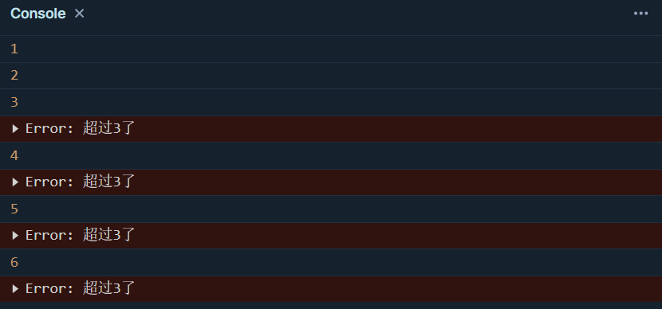
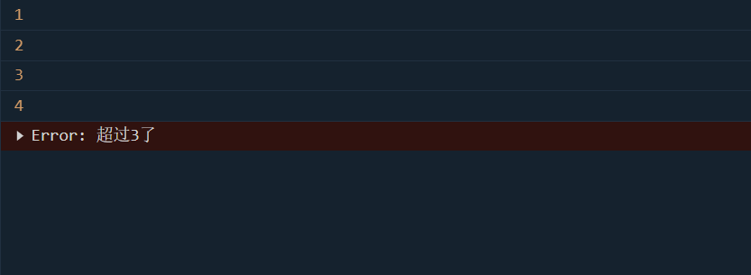
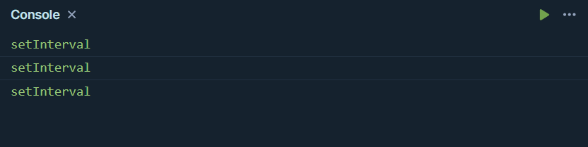
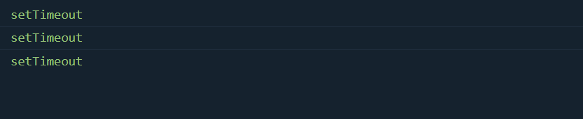

## `setInterval`无视代码错误

> 在轮询过程中即使代码报错还是会继续周期性调用代码块

```javascript
let count = 0
setInterval(() => {
  console.log(count)
  count++
  if (count > 3) {
    throw new Error('超过3了')
  }
}, 1000)
```



> 使用setTimeout解决

```javascript
let count = 0
function fun() {
  setTimeout(() => {
    count++
    console.log(count)
    if (count > 3)
      throw new Error('超过3了')
    fun()
  }, 1000)
}
fun()
```



## `setInterval`无视网络延迟

> 在setInterval中使用Ajax调用接口，如果网络延迟较高，则setInterval会持续性调用接口，导致客户端网络队列塞满Ajax请求

```javascript
let count = 1

function http() {
  return new Promise((resolve) => {
    setTimeout(() => {
      resolve(count++)
    }, 3000)
  })
}
const timer = setInterval(async () => {
  const res = await http()
  if (res === 1) {
    clearInterval(timer)
  }
  else {
    console.log('setInterval')
  }
}, 1000)
```

> 上面代码预期只发送一次请求，但是由于请求结果返回慢，导致发送了多遍



> 使用setTimeout

```javascript
let count = 0

function http() {
  return new Promise((resolve) => {
    setTimeout(() => {
      resolve(count++)
    }, 3000)
  })
}

function fun() {
  const timer = setTimeout(async () => {
    const res = await http()
    if (res === 3) {
      clearTimeout(timer)
    }
    else {
      console.log('setTimeout')
      fun()
    }
  }, 0)
}
fun()
```

> 预期是3次请求，实际也是3次请求。虽然请求返回结果较慢，但是下一次请求都是在上一次请求结束之后才会进行


