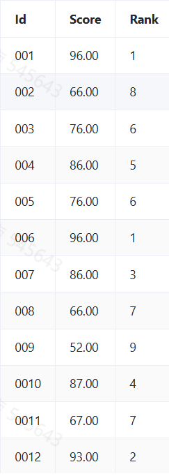

## 1. 活动参与总次数统计（SQL）
平台希望了解用户在各类活动中的总体参与情况。请你统计每位用户在每个活动中累计参与操作的总次数。

活动表
```sql
CREATE TABLE activity (
    id INT PRIMARY KEY,
    activity_name VARCHAR(50)
);
```

活动记录表

```sql
CREATE TABLE activity_record (
    id INT PRIMARY KEY,
    activity_date DATETIME,
    activity_id INT,
    user_id INT,
    activity_count INT
);
```

返回字段如下：

* `user_id` 用户 ID
* `activity_name` 活动名称
* `total_count` 该用户在该活动中累计的所有操作次数（行为类型合并统计）

✅ 限制条件

* 仅统计 `activity_date` 在 2024 年内的数据；
* 排除 `activity_count <= 0` 的记录；
* 按 `user_id ASC`, `activity_name ASC` 排序返回结果；

```sql
-- 活动参与总次数统计

SELECT 
    ar.user_id, 
    a.activity_name, 
    SUM(ar.activity_count) AS total_count
FROM 
    activity_record ar
JOIN 
    activity a ON ar.activity_id = a.id
WHERE 
    YEAR(ar.activity_date) = 2024 
    AND ar.activity_count > 0
GROUP BY 
    ar.user_id, a.activity_name
ORDER BY 
    ar.user_id ASC, a.activity_name ASC;
```

## 2. 用户活动参与跨度统计（SQL）
平台希望了解每位用户参与平台活动的活跃范围。每个活动有明确的起止时间，用户可能在这些活动期间的多个不同日期参与操作。

请编写 SQL 查询，统计每位用户在每个活动中首次参与日期与最后参与日期，并计算他们的参与跨度（天数）。

活动表 activity：
```sql
CREATE TABLE activity (
    id INT PRIMARY KEY,
    activity_name VARCHAR(50),
    description TEXT
);
```

活动记录表 activity_record：

```sql
CREATE TABLE activity_record (
    id INT PRIMARY KEY,
    activity_date DATE,
    activity_id INT,
    user_id INT,
    activity_action ENUM('login', 'post', 'share', 'view', 'like'),
    activity_count INT
);
```

返回以下字段：

* `user_id` 用户 ID
* `activity_name` 活动名称
* `first_active_date` 用户首次参与该活动的日期
* `last_active_date` 用户最后一次参与该活动的日期
* `active_span_days` 参与跨度天数（包含首尾日期）

限制条件：

* 仅统计 `activity_date` 在 2024 年内的记录；
* 排除 `activity_count <= 0` 的记录；
* 所有日期计算均为日期粒度，不含小时；
* 活跃跨度计算方式为：`DATEDIFF(last, first) + 1`；
* 最终结果按 `user_id ASC`, `activity_name ASC` 排序；

```sql
-- 用户活动参与跨度统计

SELECT 
    ar.user_id, 
    a.activity_name, 
    MIN(DATE(ar.activity_date)) AS first_active_date, 
    MAX(DATE(ar.activity_date)) AS last_active_date, 
    DATEDIFF(MAX(DATE(ar.activity_date)), MIN(DATE(ar.activity_date))) + 1 AS active_span_days
FROM 
    activity_record ar
JOIN 
    activity a ON ar.activity_id = a.id
WHERE 
    YEAR(ar.activity_date) = 2024 
    AND ar.activity_count > 0
GROUP BY 
    ar.user_id, a.activity_name
ORDER BY 
    ar.user_id ASC, a.activity_name ASC;
```

## 3. 最小化最大路径代价（算法）

给定一个 `n×n` 的方格网格，每个格子都有一个代表消耗值的非负整数。你需要从左上角 `(0,0)` 移动到右下角 `(n-1,n-1)`。

在移动过程中：

* 每一步只能向下或向右移动一格
* 路径的`总消耗`是路径上经过的所有格子的消耗值之和
* 你的任务是找到一条从左上角到右下角的路径，使得总消耗值最小

```python
# 最小化最大路径代价

def minPathSum(grid_str):
    # eval 字符串转成数组
    grid = eval(grid_str)
    n = len(grid)
    dp = [[0] * n for _ in range(n)]
    dp[0][0] = grid[0][0]
    
    for i in range(1, n):
        dp[i][0] = dp[i-1][0] + grid[i][0]
    for j in range(1, n):
        dp[0][j] = dp[0][j-1] + grid[0][j]
        
    for i in range(1, n):
        for j in range(1, n):
            dp[i][j] = grid[i][j] + min(dp[i-1][j], dp[i][j-1])
            
    return dp[n-1][n-1]
```

## 4. 极值求和（算法）
请编写一个脚本，实现将数组的最大值与数组的最小值求和的计算，具体要求如下：

* 不需要验证从测试用例获取参数的格式，获取的是数字列表，数组通过测试用例获取，参数形式是：`1,2,3,4,5`这样的一组数字，求最大值与最小值求和，如果有多个相同的最大值或最小值，把它们都加起来
* 列表内都是无序的正整数，不需要处理小数
* 请在编码区完成编码，编码区外的内容不要进行任何改动
* 输出结果仅输出求和结果即可，不需要添加额外的修饰或符号

```js
// 极值求和

function sumOfMaxAndMin(listString) {
  /***** 编码区 ******/
  const numbers = listString.split(',').map(Number);

  // 找到最大值和最小值
  const max = Math.max(...numbers);
  const min = Math.min(...numbers);

  let sumOfMax = 0;
  for (let i = 0; i < numbers.length; i++) {
    if (numbers[i] === max) {
      sumOfMax += numbers[i];
    }
  }

  if (max === min) {
    return sumOfMax
  }

  let sumOfMin = 0;
  for (let i = 0; i < numbers.length; i++) {
    if (numbers[i] === min) {
      sumOfMin += numbers[i];
    }
  }

  return sumOfMax + sumOfMin
  /***** 编码区 ******/
}
```

## 5. 数据通信可靠性校验序列（算法）
在数据通信系统中，为了确保数据传输的可靠性，工程师小A设计了一种特殊的数据校验序列。一个校验序列由`1`到`n`的排列组成，其中任意相邻两个数的乘积与特定值`k`的乘积必须是`3`的倍数。给定正整数`n`和`k`，请帮助小A计算有多少种不同的校验序列。由于结果可能很大，请将结果对 `1000000007 (10^9 + 7)` 取模后输出。

输入描述：

输入两个整数 n 和 k，以字符串形式提供：
`1 ≤ n ≤ 1000`, `1 ≤ k ≤ 100`

```js
// 数据通信可靠性校验序列

function countSequences(n_str, k_str) {
    /*****编码区*****/
    const n = parseInt(n_str);
    const k = parseInt(k_str);
    const mod = 1000000007n;
    const k_mod = k % 3;

    if (k_mod === 0) {
        let res = 1n;
        for (let i = 1; i <= n; i++) {
            res = (res * BigInt(i)) % mod;
        }
        return Number(res);
    }

    const count0 = Math.floor(n / 3);
    const count1 = n - count0;

    if (count1 > count0 + 1) {
        return 0;
    }

    const fact = new Array(n + 1);
    fact[0] = 1n;
    for (let i = 1; i <= n; i++) {
        fact[i] = (fact[i - 1] * BigInt(i)) % mod;
    }

    function powMod(base, exponent, modulus) {
        let res = 1n;
        base = base % modulus;
        while (exponent > 0n) {
            if (exponent % 2n === 1n) {
                res = (res * base) % modulus;
            }
            exponent = exponent / 2n;
            base = (base * base) % modulus;
        }
        return res;
    }

    const a = count0 + 1;
    const diff = a - count1;
    const invDiffFact = powMod(fact[diff], mod - 2n, mod);
    const P = (fact[a] * invDiffFact) % mod;
    const result = (fact[count0] * P) % mod;

    return Number(result);
    /*****编码区*****/
}
```

## 6. 消息加密子串计数（算法）
在即时通讯软件的加密系统中，需要对消息进行特殊的子序列分析。给定一个由小写字母组成的加密字符串，需要找出所有满足以下条件的子序列个数（子序列字符不要求连续，只需与原序列字符的相对顺序一致即可）：

* 子序列首尾字符相同
* 子序列长度大于等于2
* 子序列中间的字符不能与首尾字符相同

输入描述

* 输入为一个字符串s，仅包含小写字母，字符串长度范围：2 ≤ length ≤ 105

返回值描述

* 返回满足条件的子序列数量，结果对998244353取模。

```js
// 消息加密子串计数

function countSpecialSubsequences(s) {
    /*****编码区*****/
    const MOD = 998244353;
    const n = s.length;

    // 预处理幂运算，计算2^i mod MOD，用于快速计算子序列数量
    const pow2 = new Array(n + 1).fill(1);
    for (let i = 1; i <= n; i++) {
        pow2[i] = (pow2[i - 1] * 2) % MOD;
    }

    // 预处理前缀和，prefix[i][c]表示前i个字符中字符c的出现次数
    const prefix = new Array(n + 1);
    for (let i = 0; i <= n; i++) {
        prefix[i] = new Array(26).fill(0);
    }

    // 存储每个字符出现的位置
    const positions = Array.from({ length: 26 }, () => []);

    for (let i = 0; i < n; i++) {
        // 复制前一个位置的计数
        for (let c = 0; c < 26; c++) {
            prefix[i + 1][c] = prefix[i][c];
        }
        // 增加当前字符的计数
        const charCode = s.charCodeAt(i) - 97; // 'a' -> 0, 'z' -> 25
        prefix[i + 1][charCode]++;
        positions[charCode].push(i);
    }

    let result = 0;

    // 对于每个字符c
    for (let c = 0; c < 26; c++) {
        const pos = positions[c];
        const lenPos = pos.length;

        // 如果字符c出现少于2次，无法形成有效子序列
        if (lenPos < 2) continue;

        // 对于每对位置(pi, pj)，i < j
        for (let i = 0; i < lenPos; i++) {
            for (let j = i + 1; j < lenPos; j++) {
                const pi = pos[i];
                const pj = pos[j];
                const len = pj - pi - 1; // 中间字符总数量

                if (len <= 0) {
                    // 中间没有字符，无法形成有效子序列
                    continue;
                }

                // 计算中间包含c的数量
                const countC = prefix[pj][c] - prefix[pi + 1][c];
                // 中间不包含c的字符数量
                const noC = len - countC;

                if (noC <= 0) {
                    // 中间没有不包含c的字符，无法形成有效子序列
                    continue;
                }

                // 有效子序列数量 = 2^noC - 1（减去空序列的情况）
                result = (result + (pow2[noC] - 1 + MOD) % MOD) % MOD;
            }
        }
    }

    return result;
    /*****编码区*****/
}
```

## 7. 智能电网负载区间统计器（算法）

某智能电网系统需要监控多个配电区域的用电负载。每个区域都有其额定负载范围（以千瓦为单位），系统需要评估所有区域的用电负载覆盖情况。给定多个负载区间，请计算这些区间覆盖的所有整数负载点数量。要求对重叠区间进行合并，每个负载值只能计数一次。

为提高难度，增加以下约束：

* 区间数量范围为 `[1, 10000]`
* 每个区间的起始值和结束值范围为 `[-10^9, 10^9]`
* 区间的开始值可能大于结束值，需要交换确保有效

输入描述
* 输入参数 intervals: ArrayList<int[]>，表示多个负载区间
* 每个区间包含两个整数 [start, end]，分别表示起始负载值和结束负载值
* 区间数量不超过 10000
* 负载值范围在 [-109, 109] 之间

返回值描述
* 返回一个长整型数值，表示所有区间覆盖的不重复负载点总数
* 如果存在无效区间（start > end），需要先将其调整为有效区间

```js
// 智能电网负载区间统计器

function countLoadPoints(input) {
    const intervals = JSON.parse(input);

    const validIntervals = intervals.map(interval => {
        let [start, end] = interval;
        if (start > end) {
            [start, end] = [end, start];
        }
        return [start, end];
    });

    validIntervals.sort((a, b) => a[0] - b[0]);

    const merged = [];
    for (const interval of validIntervals) {
        if (merged.length === 0) {
            merged.push(interval);
        } else {
            const last = merged[merged.length - 1];
            if (interval[0] <= last[1]) {
                last[1] = Math.max(last[1], interval[1]);
            } else {
                merged.push(interval);
            }
        }
    }

    let total = 0;
    for (const interval of merged) {
        total += interval[1] - interval[0] + 1;
    }

    return total;
}
```

## 8. 糖果分配（算法）
有N个小朋友站在一排，每个小朋友都有一个评分。现在要按以下的规则给孩子们分糖果：

* 每个小朋友至少要分得一颗糖果
* 分数高的小朋友要他比旁边得分低的小朋友分得的糖果多，也要与相邻、分数相等的小朋友糖果一样多
* 请计算出最少要分发多少颗糖果？
```js
// 糖果分配

function minCandies(scoresStr) {
    /***** 编码区 *****/
    const nums = scoresStr.split(',').map(Number)

    // 生成相同长度的数组，初始值都为1
    const candies = new Array(nums.length).fill(1)
    // 从左到右遍历
    for (let i = 1; i < nums.length; i++) {
        if (nums[i] > nums[i - 1]) {
            candies[i] = candies[i - 1] + 1
        }
        if (nums[i] === nums[i - 1]) {
            candies[i] = candies[i - 1]
        }
    }

    // 从右到左遍历
    for (let i = nums.length - 2; i >= 0; i--) {
        if (nums[i] > nums[i + 1]) {
            candies[i] = Math.max(candies[i], candies[i + 1] + 1)
        }
        if (nums[i] === nums[i + 1]) {
            candies[i] = Math.max(candies[i], candies[i + 1])
        }
    }
    return candies.reduce((a, b) => a + b, 0)
    /***** 编码区 *****/
}
```

## 9. 汽水兑换计算器（算法）

一元一瓶汽水，两个空瓶可以换一瓶汽水。如果你的钱数是`n`，最多可以喝到几瓶汽水？具体要求如下：

* 输出不需要添加任何修饰，输出具体数字即可
* 从测试用例获取表示金额的参数n，金额n都是大于0的正整数，不需要验证其格式

```js
// 汽水兑换计算器

function maxSodas(n, emptyBottles = 0) {
    /***** 编码区 *****/
    let total = n; // 初始购买的汽水数量
    let bottles = n; // 初始空瓶数量

    while (bottles >= 2) {
        const exchange = Math.floor(bottles / 2); // 可兑换的汽水数
        total += exchange;
        bottles = bottles % 2 + exchange; // 剩余空瓶 = 兑换后剩余的空瓶 + 新产生的空瓶
    }
    return total
    /***** 编码区 *****/
}
```

## 10. 服务器任务调度器（算法）

在数据中心的服务器集群中，需要对服务器进行任务调度配对。每台服务器都有一个处理能力值`(power)`，为了优化性能，我们需要合理分配任务。

系统按照以下规则进行任务配对：

* 每次必须选择两台服务器进行配对，每次配对会产生1分收益
* 如果配对的两台服务器`power`值之差的绝对值不超过`threshold`，将额外产生1分收益
* 每次配对后，两台服务器都将从系统中移除
* 调度持续进行直到无法再进行配对(剩余`0`或`1`台服务器)

输入描述：
* `powers`：整数数组，表示每台服务器的`power`值`(1 ≤ power ≤ 100)`
* `threshold`：整数，表示允许的`power`差值阈值`(1 ≤ threshold ≤ 50)`

返回值描述：
* 返回整数，表示最大可能获得的收益值

```js
// 服务器任务调度器

function maxPairingScore(powers, threshold) {
  /*****编码区*****/
  // 对服务器power值进行排序
  powers.sort((a, b) => a - b);

  const n = powers.length;
  // dp[i]表示前i台服务器能获得的最大收益
  const dp = new Array(n + 1).fill(0);

  for (let i = 2; i <= n; i++) {
    // 不选择第i-1台服务器进行配对的情况
    dp[i] = dp[i - 1];

    // 选择第i-1台和第i-2台服务器进行配对的情况
    const diff = Math.abs(powers[i - 1] - powers[i - 2]);
    const currentScore = 1 + (diff <= threshold ? 1 : 0);
    dp[i] = Math.max(dp[i], dp[i - 2] + currentScore);
  }

  return dp[n];
  /*****编码区*****/
}
```

## 11. 试卷分数统计（算法）

在教育系统中，需要统计学生考试成绩。给定一个字符串，表示一次考试中每道题目的得分情况。每道题的信息按照"题号-得分"格式给出，题号为数字，得分为整数。现在需要计算：

* 所有题目的总分
* 得分最高的题目分数
* 有效题目数量（得分大于0的题目）

最后按照格式"总分/最高分/有效题数"输出结果。

输入描述：

* 输入一个字符串，格式为"题号-得分"，题目之间用分号分隔，例如"1-20;2-50;3-0"
* 题号范围：[1,100]
* 单题分数范围：[0,100]
* 题目数量范围：[1,50]

返回值描述：
* 返回一个字符串，格式为"总分/最高分/有效题数"

```js
// 试卷分数统计

function analyzeScores(scores) {
    //请输入你的逻辑代码
    const ss = scores.split(";").map(score => parseInt(score.split('-')[1]))

    const total = ss.reduce((acc, score) => acc + score, 0)
    const max = Math.max(...ss)
    const valid = ss.filter(s => s > 0)

    return total + '/' + max + '/' + valid.length
}
```

## 12. 最小覆盖子串（算法）

给定两个字符串 `S` 和 `T`，请在字符串 `S` 中找出：包含 `T` 所有字符的最小子串。

要求：

* 如果 `S`中不存在包含 `T` 所有字符的子串，则返回 `Not Found`。
* 如果存在这样的子串，我们保证它是唯一的答案。
* 子串中可以包含 `T` 中字符以外的其他字符。
* 子串中只需包含 `T` 中的所有字符（包括重复的字符），不需要按 `T` 中的顺序出现。
* 你可以假设 `S` 和 `T` 中都只包含英文字母。

详细描述

* 子串定义：`S` 的一个连续片段。
* 覆盖： 一个子串"覆盖" `T`，意味着这个子串包含了 `T` 中的所有字符，且每个字符出现的次数不少于它在 `T` 中出现的次数。
* 最小：在所有覆盖 `T` 的子串中，长度最短的那个。

查找过程：
* 从 `S` 的左侧开始，逐步向右扩展，直到找到一个覆盖 `T` 的子串。
* 然后尝试从左侧缩小这个子串，同时保持对 `T` 的覆盖。
* 重复这个过程，直到遍历完整个 `S`。

简单例子

* 假设：`S = ADOBECODEBANC`, `T = ABC`

查找过程：

* 从左向右扫描，找到第一个覆盖 `ABC` 的子串：`ADOBEC`
* 尝试缩小范围，移除 `ADO`，得到 `BEC`，但它不再覆盖 `ABC`
* 继续向右扫描，找到 `BANC`
* 尝试缩小 `BANC`，但无法再缩小同时保持覆盖
* 因此，最终结果是 `BANC`

输入描述

* `S`：源字符串，包含英文字母
* `T`：目标字符串，包含英文字母
输出描述

* `S` 中包含 `T` 所有字符的最小子串。如果不存在，则输出 `Not Found`。

```js
// 最小覆盖子串

function minWindow(str1, str2) {
    // 请在此处编码
    // 统计T中每个字符的出现次数
    const tCount = {};
    for (const char of str2) {
        tCount[char] = (tCount[char] || 0) + 1;
    }

    // 记录当前窗口中str2字符的出现次数
    const windowCount = {};

    // 记录已经满足的字符数量
    let have = 0;
    // 需要满足的字符数量
    const need = Object.keys(tCount).length;

    // 记录最小窗口的信息
    let result = "";
    let minLength = Infinity;

    // 滑动窗口的左右指针
    let left = 0;

    // 移动右指针扩大窗口 
    for (let right = 0; right < str1.length; right++) {
        const char = str1[right];

        // 如果当前字符是T中的字符，更新窗口计数
        if (tCount[char] !== undefined) {
            windowCount[char] = (windowCount[char] || 0) + 1;

            // 如果当前字符的数量已经满足T中的要求，更新have
            if (windowCount[char] === tCount[char]) {
                have++;
            }
        }

        // 当窗口已经包含T中的所有字符时，尝试缩小窗口
        while (have === need) {
            // 计算当前窗口的长度
            const currentLength = right - left + 1;

            // 如果当前窗口更小，更新结果
            if (currentLength < minLength) {
                minLength = currentLength;
                result = str1.substring(left, right + 1);
            }

            // 尝试移动左指针缩小窗口
            const leftChar = str1[left];
            left++;

            // 如果左指针指向的是T中的字符，更新窗口计数
            if (tCount[leftChar] !== undefined) {
                // 如果减少后数量不再满足要求，更新have
                if (windowCount[leftChar] === tCount[leftChar]) {
                    have--;
                }
                windowCount[leftChar]--;
            }
        }
    }

    return result === "" ? "Not Found" : result;
}
```

## 13. 每份试卷和每个题目被作答的人数和次数（SQL）
某学校软件学院组织进行线上答题，现要统计每份试卷和每个题目被作答的人数和次数。

要求编写一个SQL查询，请统计每个题目和每份试卷被作答的人数和次数，需返回类别`（tid）`、人数`（uv）`、次数`（pv）`，类别按类别`ID（tid）`升序输出，试卷类和题目类分别按人数（`uv）`和次数`（pv）`降序输出。

数据库中有两个表：`exam_record`和`practice_record`。

题目练习表`practice_record`存储了题目信息，包括用户`ID（uid）`、题目`ID（question_id）`、提交时间`（submit_time）`、得分`（score）`。

试卷作答记录表`exam_record`存储了用户答题信息，包括用户`ID（uid）`、试卷`ID（exam_id）`、开始作答时间`（start_time）`、交卷时间`（submit_time）`、得分`（score）`。

```sql
-- 每份试卷和每个题目被作答的人数和次数

SELECT * FROM (
    -- 统计题目作答情况
    SELECT 
        question_id AS tid,
        COUNT(DISTINCT uid) AS uv,
        COUNT(*) AS pv
    FROM practice_record
    GROUP BY question_id
    
    UNION ALL
    
    -- 统计试卷作答情况
    SELECT 
        exam_id AS tid,
        COUNT(DISTINCT uid) AS uv,
        COUNT(*) AS pv
    FROM exam_record
    GROUP BY exam_id
) AS stats
-- 按要求排序：tid升序；题目按pv降序，试卷按uv降序
ORDER BY 
    tid ASC,
    CASE WHEN tid < 9000 THEN pv ELSE uv END DESC;
```

## 14. 分析运营商客户订购服务数量和种类（SQL）
运营商数据库中有两个表：`Customers`和`Orders`。`Customers`表存储客户信息，包括客户`ID（customer_id）`和客户名字`（customer_name）`。`Orders`表记录了服务的订购信息，包括订单`ID（order_id）`、客户`ID（customer_id）`、服务`ID（service_id）`、订购数量`（quantity）`和订购日期`（order_date）`。

要求编写一个SQL查询，分析`2024年1月份`每个客户订购的总服务数量，并找出订购总量在前`5`名的客户及其订购详情。需要返回客户名字`（customer_name）`、客户的总订购数量`（total_quantity）`和他们订购的不同服务种类数量`（service_count）`，按总订购数量降序排序。

```sql
-- 分析运营商客户订购服务数量和种类

-- 查询2024年1月订购总量前5的客户及订购详情
SELECT
    c.customer_name,
    SUM(o.quantity) AS total_quantity,
    COUNT(DISTINCT o.service_id) AS service_count
FROM
    Customers c
INNER JOIN
    Orders o ON c.customer_id = o.customer_id
WHERE
    -- 筛选2024年1月份的订单（包含当月第一天和最后一天）
    o.order_date BETWEEN '2024-01-01' AND '2024-01-31'
GROUP BY
    -- 按客户主键+姓名分组，确保分组唯一性（避免同名客户冲突）
    c.customer_id, c.customer_name
ORDER BY
    -- 按总订购数量降序排序，优先展示高订购量客户
    total_quantity DESC
-- 限制结果为前5条，即订购总量TOP5客户
LIMIT 5;
```

## 15. 排名次（SQL）

编写一个 SQL 查询来实现分数排名。如果两个分数相同，则两个分数排名`（Rank）`相同。请注意，平分后的下一个名次应该是下一个连续的整数值。换句话说，名次之间不应该有“间隔”。具体要求如下：
1、原始表格数据示例如下，表名是：`score12311`，两个字段分别是`VARCHAR`和`DECIMAL`类型：


2、输出结果如下图，按id的升序排序输出



```sql
-- 排名次

SELECT 
    id AS Id, 
    score AS Score, 
    DENSE_RANK() OVER (ORDER BY score DESC) AS 'Rank'
FROM score12311
ORDER BY id;
```

## 16. 计算每个月相比上个月的贷款总额的增长率（SQL）

业务背景是一个银行贷款业务的环境，银行为客户提供各种贷款业务。
有两个主要的数据库表：

1. `Customers` 表：此表包含银行所有客户的信息。主要字段有：

    * `id`: 客户ID，这是主键，用于唯一标识一个客户。
    * `name`: 客户的姓名。
    * `status`: 客户的状态，可能的值包括"active"（活跃）, “inactive”（不活跃）等。
    * `loan_amount`: 客户的贷款总额度。
    * `loan_balance`: 客户的贷款余额。

2. Loans 表：此表包含了客户的所有贷款记录。主要字段有：

    * `id`: 记录ID，这是主键，用于唯一标识一条贷款记录。
    * `customer_id`: 关联到Customers表的客户ID，标识这条贷款记录是哪个客户的。
    * `loan_id`: 贷款ID，每笔贷款的唯一标识。
    * `amount`: 此次贷款的金额。
    * `loan_date`: 此次贷款的日期。

问题：

计算每个月相比上个月的贷款总额的增长率，四舍五入保留两位小数。输出月份（不需要最初的月份）和增长率

```sql
-- 计算每个月相比上个月的贷款总额的增长率

WITH loan_months AS (
    SELECT 
        DATE_FORMAT(loan_date, '%Y%m') AS month, 
        SUM(amount) AS total_amount
    FROM Loans
    GROUP BY DATE_FORMAT(loan_date, '%Y%m')
)
SELECT 
    lm.month AS Month,
    ROUND(((lm.total_amount - lm_prev.total_amount) / lm_prev.total_amount * 100), 2) AS GrowthRate
FROM loan_months lm
LEFT JOIN loan_months lm_prev ON lm_prev.month = DATE_FORMAT(STR_TO_DATE(CONCAT(lm.month, '01'), '%Y%m%d') - INTERVAL 1 MONTH, '%Y%m')
WHERE lm_prev.total_amount > 0;
```

## 17. 按照要求将表的列转为行（SQL）

有表如下：
```sql
create table scores(
    name varchar(32) comment '学生姓名',
    Math int comment ‘数学成绩’,
    Chinese int comment ‘语文成绩’,
    English int comment ‘英语成绩’, 
    History int comment ‘历史成绩’;
)
```
现在要求对表转换，显示结果包含三列，分别为：`name`表示学生姓名，`subject`表示科目名称，`score`表示科目分数，并且要求按照学生姓名,学科升序排列

```sql
-- 按照要求将表的列转为行

SELECT name, '数学' AS subject, Math AS score FROM scores
UNION ALL
SELECT name, '语文' AS subject, Chinese AS score FROM scores
UNION ALL
SELECT name, '英语' AS subject, English AS score FROM scores
UNION ALL
SELECT name, '历史' AS subject, History AS score FROM scores
ORDER BY name, subject;
```

## 18. 查询平均成绩大于30分记录（SQL）

`tb_user_score` 是一个学生成绩记录表。老师需要查询平均成绩大于`30`分的 `uid` 和平均成绩，对 `score` 保留 `2` 位小数并按平均成绩倒序排列。

```sql
-- 查询平均成绩大于30分记录

SELECT 
    uid, 
    ROUND(AVG(score), 2) AS average 
FROM 
    tb_user_score 
GROUP BY 
    uid 
HAVING 
    AVG(score) > 30 
ORDER BY 
    average DESC;
    
```