# 使用Docker快速部署前后端项目

## 1. 克隆运行案例项目

> 后端以[ruoyi-vue-pro](https://github.com/YunaiV/yudao-cloud)微服务版项目为例，根据项目文档成功在本地运行三个基本的微服务，`yudao-gateway`、`yudao-module-infra`、`yudao-module-system`
>
> 前端以[yudao-ui-admin-vue3](https://github.com/yudaocode/yudao-ui-admin-vue3)为例，根据项目文档成功在本地运行

## 2. 创建Docker Network

```shell
docker network create yudao
```

创建网络之后，网络内的容器可以通过别名进行互相访问

## 3. 后端创建Dockerfile

```dockerfile
## AdoptOpenJDK 停止发布 OpenJDK 二进制，而 Eclipse Temurin 是它的延伸，提供更好的稳定性
## 感谢复旦核博士的建议！灰子哥，牛皮！
FROM eclipse-temurin:8-jre

## 创建目录，并使用它作为工作目录
RUN mkdir -p /yudao-gateway
WORKDIR /yudao-gateway
## 将后端项目的 Jar 文件，复制到镜像中
COPY ./target/yudao-gateway.jar app.jar

## 设置 TZ 时区
## 设置 JAVA_OPTS 环境变量，可通过 docker run -e "JAVA_OPTS=" 进行覆盖
ENV TZ=Asia/Shanghai JAVA_OPTS="-Xms512m -Xmx512m"

## 暴露后端项目的 48080 端口
EXPOSE 48080

## 启动后端项目   在原有基础上指定在生产上使用的配置文件为prod
CMD java ${JAVA_OPTS} -Dspring.profiles.active=prod -Djava.security.egd=file:/dev/./urandom -jar app.jar
```

IDEA连接到WSL的Docker

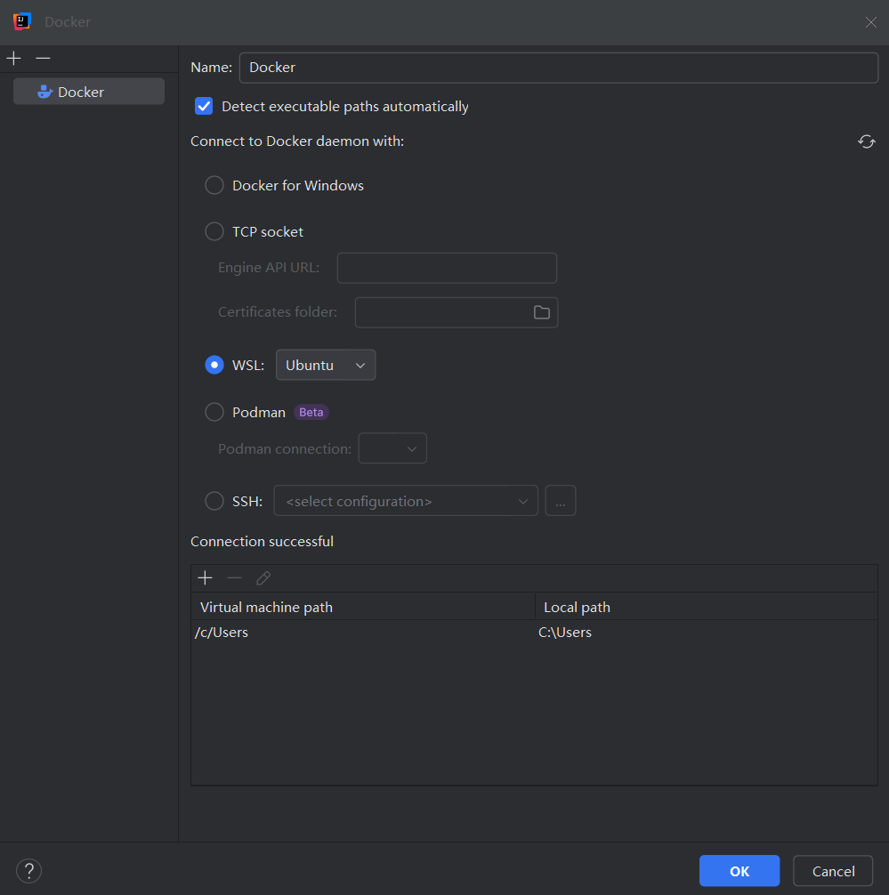


## 4. 启动中间件并连接到网络

使用docker部署MySQL、Nacos、Redis等中间件并连接到yudao

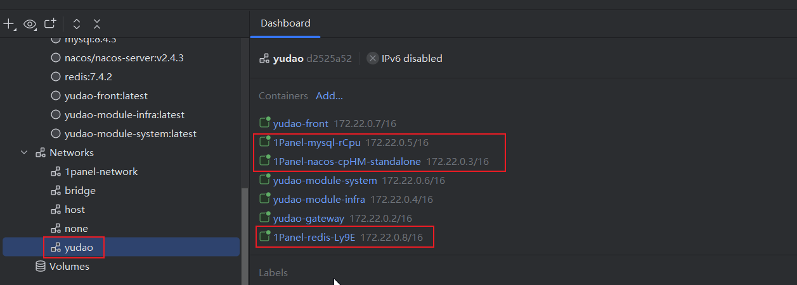

修改配置文件Naocs、MySQL、Redis连接参数，因为部署之后都在同一个网络内，所以可以直接使用网络别名

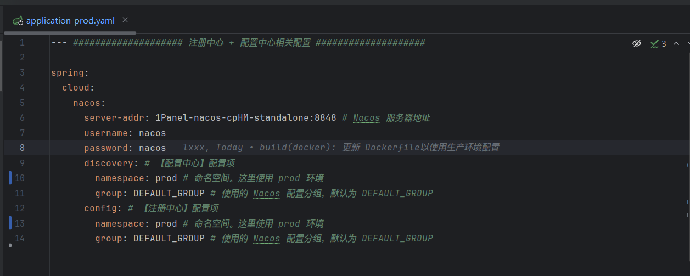

## 5. 后端启动Dockerfile

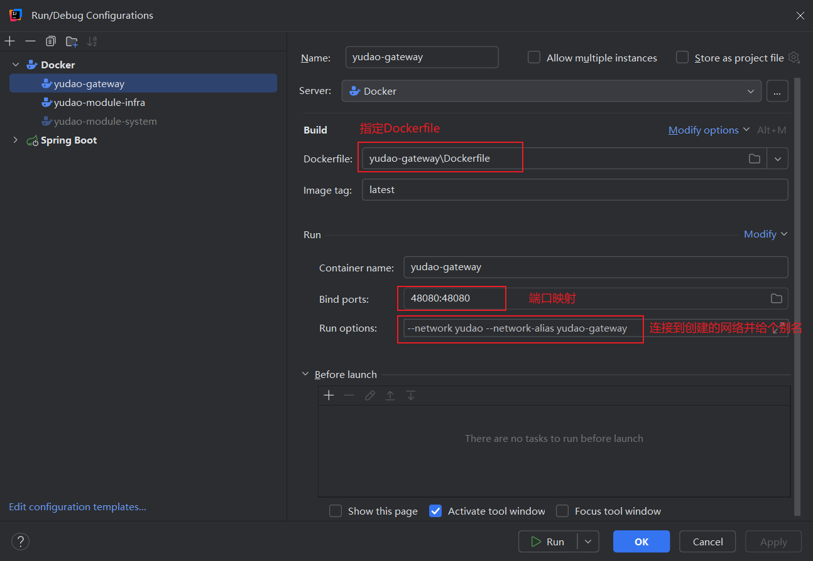

Gateway、Infra、System三个微服务都运行成功之后可以在Nacos上看到都已经注册上去，并且都在yudao这个网络内

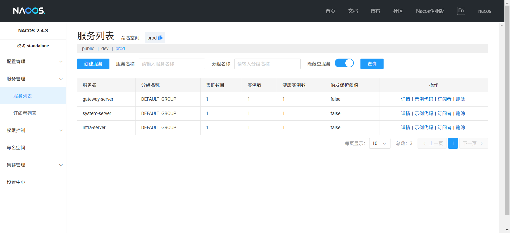

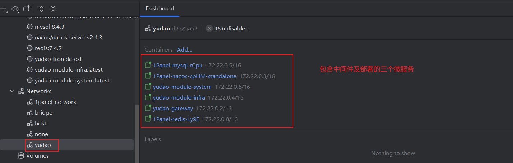

## 6. 前端创建Dockerfile

确保容器暴露的端口和打包的请求地址之后一致，后续修改Nginx配置以实现接口转发

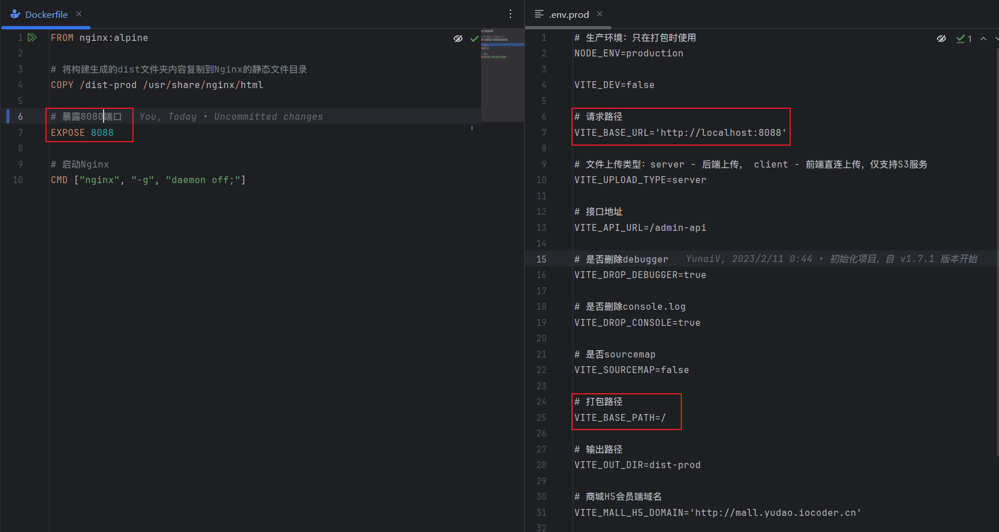

## 7. 编写一个Nginx配置文件

编写后放到`/usr/local/nginx`文件夹下（和容器启动参数映射地址保持一致）

```nginx

user  nginx;
worker_processes  auto;

error_log  /var/log/nginx/error.log notice;
pid        /var/run/nginx.pid;


events {
    worker_connections  1024;
}


http {
    include       /etc/nginx/mime.types;
    default_type  application/octet-stream;

    log_format  main  '$remote_addr - $remote_user [$time_local] "$request" '
                      '$status $body_bytes_sent "$http_referer" '
                      '"$http_user_agent" "$http_x_forwarded_for"';

    access_log  /var/log/nginx/access.log  main;

    sendfile        on;
    #tcp_nopush     on;

    keepalive_timeout  65;

    #gzip  on;

    server {
	
	listen		8088;
	server_name	localhost;
	
	location / {
       # 地址和Dockerfile文件编写的存放打包后的文件地址一致
	   alias /usr/share/nginx/html/;
	   index index.html;
	   try_files $uri $uri/ /index.html;
	}

        # 配置接口转发至网关的48080端口
        location /admin-api/ {
           proxy_pass   http://yudao-gateway:48080/admin-api/;
        }
    }
    include /etc/nginx/conf.d/*.conf;
}
```

## 8. 前端启动Dockerfile

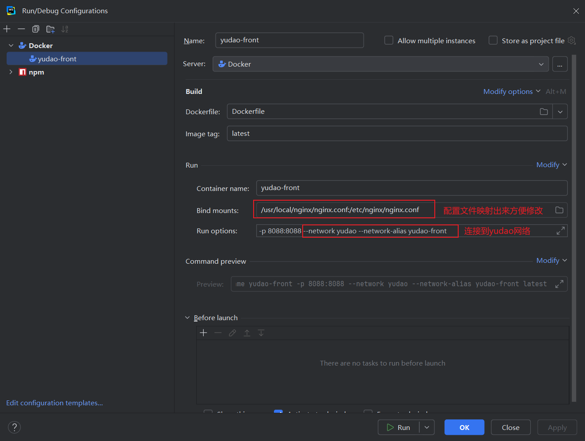

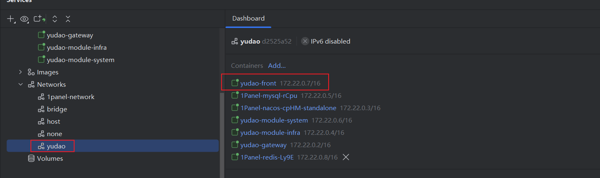

## 9. 效果

访问`http://localhost:8088`

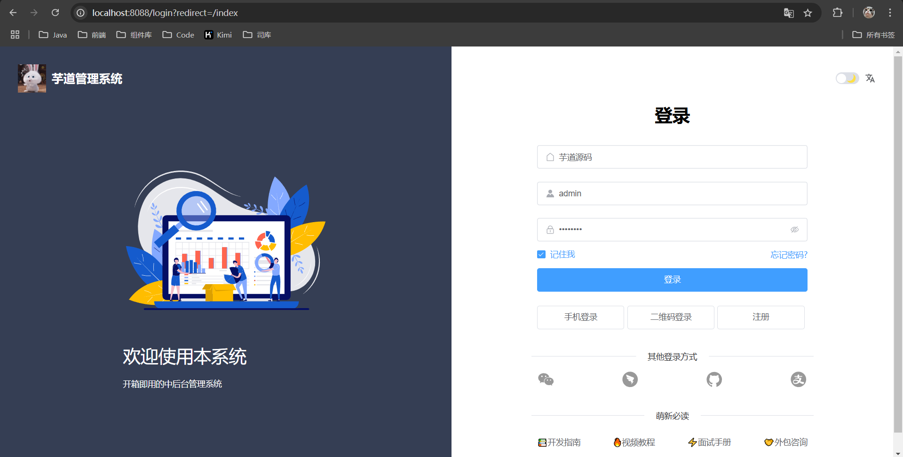

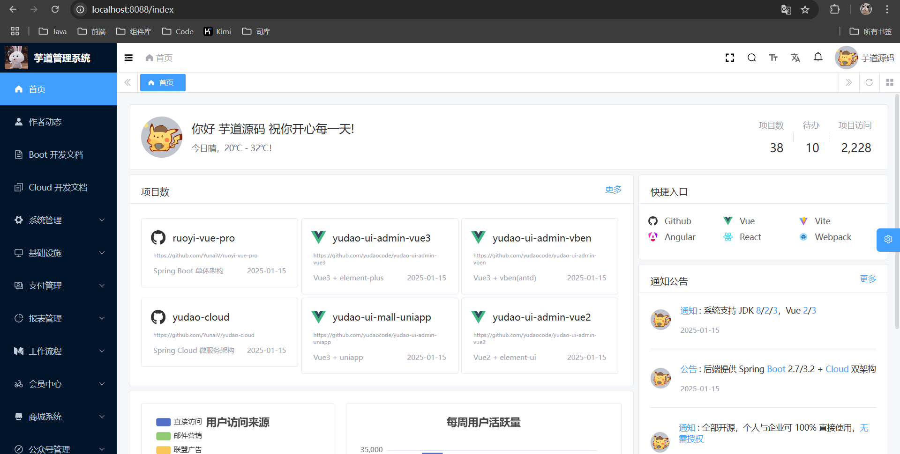
