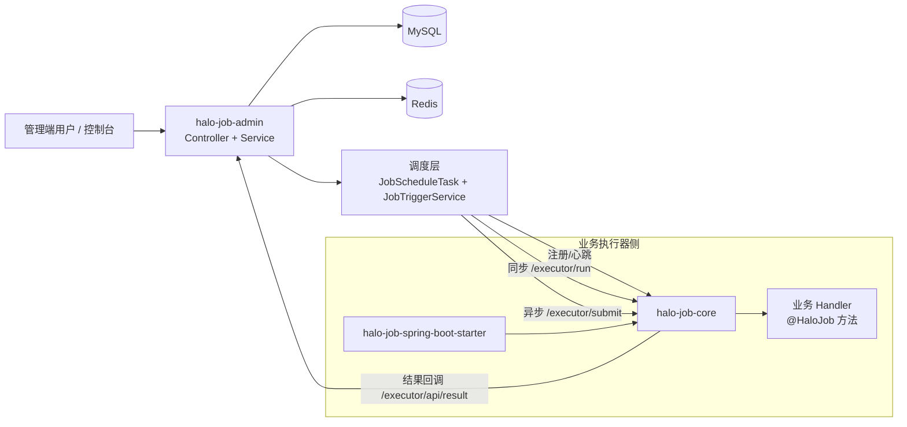
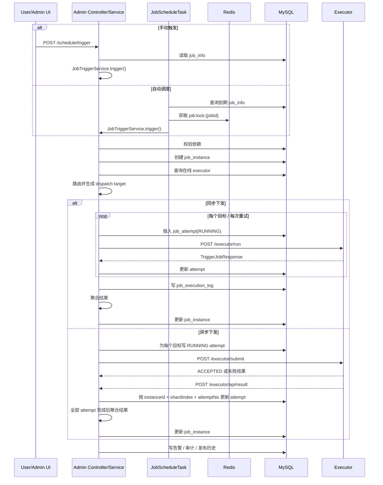
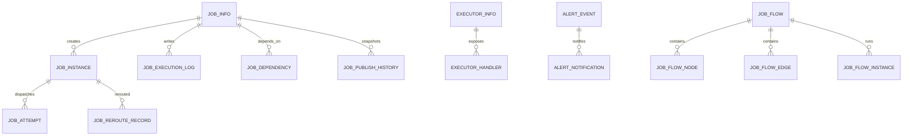
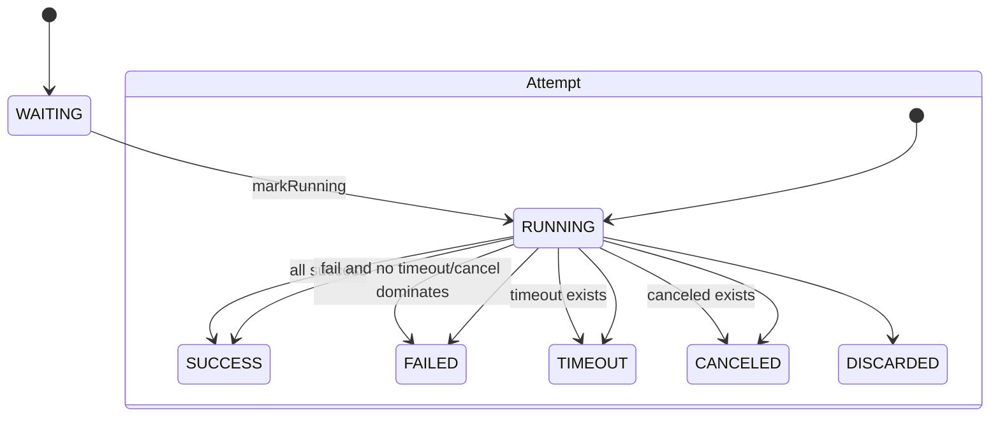

# Halo-Job 后端手册

> https://github.com/zorroe/halo-job

## 1. 使用说明

你最终要建立五个核心认识：

第一，这个系统到底解决什么问题。

第二，Admin 和 Executor 为什么要拆开。

第三，一个任务从创建到完成，具体经过哪些类、表和接口。

第四，代码里为什么用了这些设计模式。

第五，以后你要扩展功能时，应该从哪里下手。

本文只覆盖后端范围：

- `halo-job-admin`
- `halo-job-core`
- `halo-job-spring-boot-starter`
- `sql/halo-job-full.sql`

本文不展开 `halo-job-console` 前端实现，也不深入部署脚本和外部告警平台接入。

事实来源以当前 Java 代码和 `sql/halo-job-full.sql` 为准。`docs` 目录中的 API、接入、技术设计、设计模式文档依然有效，但它们更适合专题查阅；这份手册更适合作为总入口来系统学习。

建议阅读顺序可以概括成一句话：先看整体，再看主链路，再看专题，最后再去逐步啃源码。更具体一点，就是先看第 2 到第 5 章建立全局认识，再看第 6 到第 8 章打通调度和执行主链路，然后看第 9 到第 11 章补齐专题细节，最后按第 12 章给出的顺序实际读代码。

## 2. 这个项目解决什么问题

Halo-Job 是一个轻量级分布式任务调度系统。它想解决的不是“单机定时任务怎么跑”，而是更接近真实业务的几个问题：管理员需要统一创建、启停、查询任务；任务不一定在 Admin 自己机器上执行，而是要下发给业务系统中的执行器；同一个 Handler 可能部署了多个实例，系统需要决定发给谁；任务可能失败、超时、取消、丢弃，需要结构化记录；任务之间还可能存在依赖关系，甚至需要简单的 DAG 编排。

这个系统的核心分工可以浓缩成一句话：

> Admin 决定“什么时候、发给谁、如何记录”；Executor 决定“怎么在本地把任务跑起来”。

## 3. 整体架构

### 3.1 功能目标

把调度决策和业务执行拆开，降低耦合，让任务管理、调度策略、执行器接入和业务代码可以分别演进。

### 3.2 系统架构图



### 3.3 关键组成

| 组件 | 角色 |
| --- | --- |
| `halo-job-admin` | 调度中心。负责任务管理、调度扫描、触发器解析、misfire、路由、实例和 attempt 落库、结果聚合、权限、审计、告警、DAG、发布历史。 |
| `halo-job-core` | 执行器 SDK。负责扫描 `@HaloJob` 方法、自动注册、心跳、暴露执行接口、维护线程上下文、执行本地业务方法。 |
| `halo-job-spring-boot-starter` | 对 `halo-job-core` 的薄封装，核心作用是通过 Spring Boot auto-configuration 自动导入 `ExecutorAutoConfig`。 |
| MySQL | 持久化任务定义、执行器、实例、attempt、日志、依赖、DAG、告警、审计、发布历史。 |
| Redis | 给调度扫描器提供分布式锁，避免多节点 Admin 重复触发同一任务。 |

### 3.4 同步和异步两条下发链路

| 模式 | 入口 | 特点 |
| --- | --- | --- |
| 同步下发 | `/executor/run` | Admin 请求后等待 Executor 返回最终结果，再立即聚合并结束实例。 |
| 异步下发 | `/executor/submit` -> `/executor/api/result` | Executor 先返回 `ACCEPTED`，真正执行完成后再回调 Admin。 |

### 3.5 设计原因与取舍

这里的核心取舍有四点。第一，调度规则集中在 Admin，业务系统不需要理解触发器、路由和治理逻辑。第二，Admin 和 Executor 之间的协议尽量简单，主要通过 HTTP + JSON 通信。第三，可扩展点足够清晰，触发器、路由、misfire、重试、聚合都抽成了接口。第四，当前实现明显偏“轻量治理”，例如 DAG 和告警通知都比较克制。

### 3.6 建议继续阅读的源码入口

- `halo-job-admin/src/main/java/com/zorroe/cloud/job/admin/HaloJobAdminApplication.java`
- `halo-job-admin/src/main/resources/application.yaml`
- `halo-job-core/src/main/java/com/zorroe/cloud/job/core/config/ExecutorAutoConfig.java`
- `sql/halo-job-full.sql`

## 4. 学习前置概念

这一章不讲教科书定义，而是讲这些概念在本项目里的具体角色。

| 概念 | 在本项目里的意思 | 你要重点理解什么 |
| --- | --- | --- |
| Spring Bean | 被 Spring 管理的对象，例如 `JobTriggerServiceImpl`、`RouteStrategyManager`。 | 为什么很多扩展点只要“实现接口 + 注册成 Bean”就能生效。 |
| 自动装配 | Spring Boot 启动时自动把配置类和 Bean 装进去。 | `halo-job-spring-boot-starter` 本质上是帮业务系统自动导入 `ExecutorAutoConfig`。 |
| 拦截器 | 在 Controller 前后执行的横切逻辑。 | `AuthInterceptor` 统一做鉴权和审计。 |
| 事务 | 一组数据库操作要么都成功，要么一起回滚。 | 注册执行器、保存任务、保存 DAG、记录 reroute 都依赖事务。 |
| 线程池 | 用少量线程复用处理大量任务。 | Admin 下发任务有线程池，Executor 也有自己的执行槽模型。 |
| ThreadLocal | 把上下文绑定到当前线程。 | `HaloJobContextHolder` 让业务方法在无参情况下也能拿到任务上下文。 |
| MyBatis Mapper | Java 接口和 SQL 之间的桥梁。 | Service 负责编排业务，Mapper 负责真正访问数据库。 |
| 策略模式 | 把“会变化的算法”抽成接口。 | 路由、触发器、misfire、重试、结果聚合都用了这个思想。 |
| 模板方法 | 在父类里固定公共流程，把差异点交给子类。 | `AbstractSingleRouteStrategy` 是典型例子。 |
| 注册表模式 | 启动时建索引，运行时按 key 取结果。 | `JobMethodRegistry` 保存 `handler -> Bean + Method` 的映射。 |

一个重要提醒：

> 这个项目不是“某一个大类完成所有事情”，而是很多职责单一的小类协作完成一条业务链路。

## 5. 后端模块拆解

### 5.1 `halo-job-admin`

#### 功能目标

管理任务定义，驱动调度，维护执行器注册表，落库实例与 attempt，聚合执行结果，并承载治理能力。

#### 关键类 / 接口 / 表

- 类：`JobScheduleTask`、`JobTriggerServiceImpl`、`JobInfoServiceImpl`、`ExecutorInfoServiceImpl`
- 策略：`TriggerParserManager`、`RouteStrategyManager`、`MisfirePolicyManager`、`RetryPolicy`、`ExecutionResultAggregator`
- 表：`job_info`、`executor_info`、`executor_handler`、`job_instance`、`job_attempt`、`job_execution_log`

#### 调用时序

`管理端请求 -> Controller -> Service -> Mapper / Strategy -> MySQL / Redis / Executor`

#### 关键字段或关键状态

- `job_info.next_execute_time`
- `job_info.trigger_type`
- `job_instance.status`
- `job_attempt.status`

#### 设计原因与取舍

- 把调度决策集中到 Admin，业务系统只关注执行。
- 通过 Service、Mapper、Strategy 分层，避免一个类又写规则又写 SQL 又调 HTTP。
- 依赖 Redis 锁做多节点互斥，而不是把状态只放在 JVM 内存里。

#### 建议继续阅读的源码入口

- `halo-job-admin/src/main/java/com/zorroe/cloud/job/admin/components/JobScheduleTask.java`
- `halo-job-admin/src/main/java/com/zorroe/cloud/job/admin/service/impl/JobTriggerServiceImpl.java`
- `halo-job-admin/src/main/java/com/zorroe/cloud/job/admin/service/impl/JobInfoServiceImpl.java`
- `halo-job-admin/src/main/java/com/zorroe/cloud/job/admin/config/RestTemplateConfiguration.java`

### 5.2 `halo-job-core`

#### 功能目标

把一个普通 Spring Boot 业务应用变成可被调度的 Executor。

#### 关键类 / 接口 / 表

- 类：`JobAnnotationScanner`、`JobMethodRegistry`、`ExecutorAutoRegister`、`ExecutorController`、`ExecutorJobRunner`
- 注解：`@HaloJob`、`@EnableHaloJobExecutor`
- 协议：`TriggerJobRequest`、`TriggerJobResponse`

#### 调用时序

`应用启动 -> 自动装配 -> 扫描 @HaloJob -> 注册 / 心跳 -> 接收调度请求 -> 本地执行 -> 返回或回调结果`

#### 关键字段或关键状态

- `handler`
- `TriggerJobRequest.blockStrategy`
- `TriggerJobResponse.status`

#### 设计原因与取舍

- 用注解驱动接入，降低业务系统整合成本。
- 业务方法强制无参，统一从 `HaloJobContextHolder` 取上下文。
- 通过 `ExecutorJobRunner` 统一封装执行队列和阻塞策略。

#### 建议继续阅读的源码入口

- `halo-job-core/src/main/java/com/zorroe/cloud/job/core/config/ExecutorAutoConfig.java`
- `halo-job-core/src/main/java/com/zorroe/cloud/job/core/component/JobAnnotationScanner.java`
- `halo-job-core/src/main/java/com/zorroe/cloud/job/core/component/ExecutorAutoRegister.java`
- `halo-job-core/src/main/java/com/zorroe/cloud/job/core/controller/ExecutorController.java`

### 5.3 `halo-job-spring-boot-starter`

#### 功能目标

让业务项目只引入一个 starter 依赖，就具备 Halo-Job Executor 能力。

#### 关键类 / 接口 / 表

- `META-INF/spring/org.springframework.boot.autoconfigure.AutoConfiguration.imports`
- `com.zorroe.cloud.job.core.config.ExecutorAutoConfig`

#### 调用时序

`业务项目引入 starter -> Spring Boot 读取 auto-configuration imports -> 导入 ExecutorAutoConfig -> 执行器能力自动生效`

#### 关键字段或关键状态

- starter 本身几乎没有业务状态。
- 真正逻辑都在 `halo-job-core`。

#### 设计原因与取舍

- 这是典型的薄 starter 设计。
- 好处是接入简单。
- 代价是阅读时要知道“starter 只是入口，真正逻辑在 core”。

#### 建议继续阅读的源码入口

- `halo-job-spring-boot-starter/pom.xml`
- `halo-job-spring-boot-starter/src/main/resources/META-INF/spring/org.springframework.boot.autoconfigure.AutoConfiguration.imports`
- `halo-job-core/src/main/java/com/zorroe/cloud/job/core/config/ExecutorAutoConfig.java`

## 6. 共享协议与公共模型

### 6.1 功能目标

让 Admin 与 Executor 之间，以及业务方法与运行时之间，使用统一的数据契约沟通。

### 6.2 关键类 / 接口 / 表

- 注解：`@HaloJob`、`@EnableHaloJobExecutor`
- 协议：`TriggerJobRequest`、`TriggerJobResponse`
- 注册模型：`ExecutorRegistryRequest`、`ExecutorHeartbeatRequest`、`ExecutorHandlerDefinition`
- 通用响应：`Result<T>`、`ResultCode`

### 6.3 调用时序

`@HaloJob` 标注业务方法 -> 扫描成 `ExecutorHandlerDefinition` -> 注册到 Admin -> Admin 下发 `TriggerJobRequest` -> Executor 返回 `TriggerJobResponse`

### 6.4 关键字段或关键状态

#### `@HaloJob`

| 字段 | 作用 |
| --- | --- |
| `value` | Handler 名称，是调度定位业务方法的核心键。 |
| `desc` | 任务描述，展示给管理端。 |
| `author` / `tags` | 元数据。 |
| `paramSchema` / `resultSchema` | 参数和返回值的描述性 schema。 |

#### `TriggerJobRequest`

| 字段 | 作用 |
| --- | --- |
| `jobId` / `instanceId` | 标识任务和实例。 |
| `attemptNo` | 第几次尝试。 |
| `handler` | 要执行的 Handler 名称。 |
| `param` | 执行参数。 |
| `blockStrategy` | 执行器侧阻塞策略。 |
| `shardIndex` / `shardTotal` | 分片广播所需分片上下文。 |
| `timeoutSeconds` | Executor 同步等待超时。 |
| `callbackUrl` | 异步执行完成后的回调地址。 |

#### `TriggerJobResponse`

| 字段 | 作用 |
| --- | --- |
| `success` | 是否被视为成功。注意 `ACCEPTED` 也视为“成功接单”。 |
| `status` | `ACCEPTED / SUCCESS / FAILED / DISCARDED / CANCELED / TIMEOUT`。 |
| `message` | 执行结果说明或错误原因。 |
| `costTime` | 本次执行耗时。 |
| `attemptNo` / `shardIndex` / `instanceId` | 帮助 Admin 做幂等更新和结果聚合。 |

### 6.5 设计原因与取舍

- 注解只描述“这是什么任务”，不直接耦合调度细节。
- 请求响应模型独立成类，避免 Admin 和 Executor 因 Controller 参数结构变化而失联。
- `TriggerJobResponse` 通过静态工厂方法统一构造，减少漏填公共字段的风险。

### 6.6 建议继续阅读的源码入口

- `halo-job-core/src/main/java/com/zorroe/cloud/job/core/anno/HaloJob.java`
- `halo-job-core/src/main/java/com/zorroe/cloud/job/core/anno/EnableHaloJobExecutor.java`
- `halo-job-core/src/main/java/com/zorroe/cloud/job/core/model/TriggerJobRequest.java`
- `halo-job-core/src/main/java/com/zorroe/cloud/job/core/model/TriggerJobResponse.java`
- `halo-job-core/src/main/java/com/zorroe/cloud/job/core/common/Result.java`

## 7. 调度主链路：Admin 侧到底做了什么

### 7.1 功能目标

把“任务定义”转成“一次真实执行”，并把实例、attempt、日志、告警和最终结果记录完整。

### 7.2 调度与执行时序图



### 7.3 关键类 / 接口 / 表

- `ScheduleController`
- `JobScheduleTask`
- `JobTriggerServiceImpl`
- `JobInfoServiceImpl`
- `ExecutorInfoServiceImpl`
- `JobInstanceServiceImpl`
- `JobAttemptServiceImpl`
- `job_info`、`job_instance`、`job_attempt`、`job_execution_log`、`alert_event`

### 7.4 调用时序

`保存任务 -> 规范化配置 -> 计算 next_execute_time -> 调度扫描 -> 校验依赖 -> 创建实例 -> 路由 -> 创建 attempt -> 下发 -> 聚合 -> 告警 / 日志 / 审计`

### 7.5 关键步骤详解

#### 步骤 1：任务保存时先规范化

`JobInfoServiceImpl.prepareJobForPersist()` 会在入库前完成下面这些工作：

- 统一 `task_type`
- 统一 `executor_group`、`executor_app`、`executor_handler`
- 校验并规范 `executor_param` JSON
- 设置默认值，例如 `retry_count=0`、`timeout_seconds=300`
- 调用 `TriggerParserManager.prepareForPersist()` 计算 `next_execute_time`
- 对 `JAVA_HANDLER` 任务校验 handler 是否已被在线执行器注册

这一步的意义是：后续调度阶段默认相信 `job_info` 已经是一份可执行配置。

#### 步骤 2：自动调度器每秒扫描一次

`JobScheduleTask` 在 `@PostConstruct` 后启动两个周期任务：一个是每 1 秒执行一次 `scanAndExecute()`，另一个是每 10 秒执行一次心跳检查。

`scanAndExecute()` 的主流程可以概括成一句话：先查询到期任务，再检查状态、加 Redis 锁、重读最新配置、计算 dispatch plan、判断 misfire、更新下一次执行时间，最后把真实执行提交给线程池。

#### 步骤 3：进入 `JobTriggerServiceImpl.trigger()`

`trigger()` 是 Admin 调度主入口。无论手动触发还是自动调度，最终都会走到这里。

它会顺序做这些事：校验任务依赖，创建 `job_instance`，解析 dispatch target，按配置决定同步或异步下发，聚合最终结果，并在失败时写告警。

#### 步骤 4：解析下发目标

`resolveDispatchTargets()` 分两类。`JAVA_HANDLER` 任务会先查在线执行器，再套路由策略；`HTTP_CALLBACK` 任务则不找执行器，而是直接把 `executor_param.url` 当成目标地址。

这说明 `HTTP_CALLBACK` 任务虽然也叫任务，但它的运行模型和本地 `@HaloJob` 并不一样。

#### 步骤 5：区分实例和 Attempt

这两个概念一定要分清。`job_instance` 表示一次任务触发形成的一次“运行实例”；`job_attempt` 表示这个实例下发到某个目标、某个分片、某次重试时形成的一次具体尝试。

举三个例子就很好理解：1 个目标、0 次重试时是 1 个实例配 1 个 attempt；3 个分片目标、0 次重试时是 1 个实例配 3 个 attempt；1 个目标失败后再重试 1 次时，则是 1 个实例配 2 个 attempt。

#### 步骤 6：同步下发

同步模式下，`triggerSync()` 会做下面几件事：单目标直接执行，多目标走 `dispatchExecutor` 并行执行；每次真实请求前先插入一条 `RUNNING` attempt；通过 `dispatchWithRetry()` 按 `retry_count` 决定是否继续重试；真实调用 `/executor/run`；收到结果后更新 attempt、写执行日志、聚合实例结果。

#### 步骤 7：异步下发

异步模式下，`triggerAsync()` 的逻辑也很清晰：先写 `RUNNING` attempt，然后调用 `/executor/submit`；如果立即失败，就直接更新 attempt；如果返回 `ACCEPTED`，实例继续保持 `RUNNING`；之后等待执行器回调 `/executor/api/result`，再按 `instanceId + shardIndex + attemptNo` 幂等更新 attempt；全部 attempt 都不再是 `RUNNING` 时，再聚合实例结果。

#### 步骤 8：结果聚合和告警

`DefaultExecutionResultAggregator` 会统计：

- 总目标数
- 成功数
- 是否存在超时
- 是否存在取消

最终实例状态推导规则：

- 全部成功时是 `SUCCESS`
- 否则只要有超时就是 `TIMEOUT`
- 否则只要有取消就是 `CANCELED`
- 其他情况是 `FAILED`

失败时 `AlertEventServiceImpl.alert()` 会写 `alert_event`，并生成 `alert_notification` 记录。

### 7.6 关键字段或关键状态

| 对象 | 核心字段 / 状态 | 作用 |
| --- | --- | --- |
| `job_info` | `job_status` | 决定任务是否启用。 |
| `job_info` | `next_execute_time` | 决定自动调度是否能扫描到它。 |
| `job_instance` | `WAITING / RUNNING / SUCCESS / FAILED / CANCELED / TIMEOUT` | 一次实例生命周期。 |
| `job_attempt` | `RUNNING / SUCCESS / FAILED / CANCELED / TIMEOUT / DISCARDED` | 某次具体尝试的生命周期。 |
| `TriggerRunStatusEnum` | `ACCEPTED` | 只代表异步入队成功，不代表业务成功。 |

### 7.7 设计原因与取舍

- 先建实例再下发，保证任何一次触发都可追踪。
- attempt 独立建表，更适合表达重试、分片和 reroute。
- 同步和异步共用一套实例 / attempt 模型，减少状态系统复杂度。
- 当前重试只针对 `FAILED`，不针对 `TIMEOUT`、`CANCELED`、`DISCARDED`。

### 7.8 建议继续阅读的源码入口

- `halo-job-admin/src/main/java/com/zorroe/cloud/job/admin/controller/ScheduleController.java`
- `halo-job-admin/src/main/java/com/zorroe/cloud/job/admin/components/JobScheduleTask.java`
- `halo-job-admin/src/main/java/com/zorroe/cloud/job/admin/service/impl/JobTriggerServiceImpl.java`
- `halo-job-admin/src/main/java/com/zorroe/cloud/job/admin/service/impl/JobInstanceServiceImpl.java`
- `halo-job-admin/src/main/java/com/zorroe/cloud/job/admin/service/impl/JobAttemptServiceImpl.java`

## 8. 执行器主链路：任务在本地是怎么跑起来的

### 8.1 功能目标

接住 Admin 下发的任务请求，在本地应用中找到对应业务方法，按阻塞策略执行，并把结果返回或回调给 Admin。

### 8.2 关键类 / 接口 / 表

- `ExecutorAutoConfig`
- `JobAnnotationScanner`
- `JobMethodRegistry`
- `ExecutorAutoRegister`
- `ExecutorController`
- `ExecutorJobRunner`
- `HaloJobContext`
- `HaloJobContextHolder`

### 8.3 调用时序

`业务系统启动 -> 自动装配 -> 扫描 @HaloJob -> 注册与心跳 -> 接收 /executor/run 或 /executor/submit -> 排队执行 -> 绑定 ThreadLocal 上下文 -> 反射调用业务方法 -> 返回或回调结果`

### 8.4 关键步骤详解

#### 步骤 1：扫描 `@HaloJob`

`JobAnnotationScanner` 会遍历 Spring 容器中的 Bean，找到带 `@HaloJob` 的方法。

扫描时会做两件关键事：

- 校验方法必须无参
- 调用 `JobMethodRegistry.register()` 把 handler 和真实方法绑定起来

本质上它建立了这样一张注册表：

`handlerName -> (bean, method, description, author, tags, schema...)`

#### 步骤 2：自动注册和心跳

`ExecutorAutoRegister` 是 `CommandLineRunner`，应用启动后会：

- 计算自己的访问地址
- 调用 Admin `/executor/api/register`
- 启动单线程定时器，每 5 秒发一次 `/executor/api/beat`

Admin 侧每 10 秒检查一次心跳，并把 30 秒未续约的执行器标成离线。

#### 步骤 3：接收 `/executor/run`

同步模式入口是 `ExecutorController.run()`。它的工作是：

- 规范化请求默认值
- 检查 handler 是否为空
- 从 `JobMethodRegistry` 找到对应方法
- 调用 `ExecutorJobRunner.run()`
- 最终进入 `invokeHandler()`

#### 步骤 4：接收 `/executor/submit`

异步模式入口是 `ExecutorController.submit()`。和同步模式的核心差异只有两点：

- 入队成功后立即返回 `ACCEPTED`
- 真正执行完成后再通过 `callbackResult()` 回调 Admin

#### 步骤 5：阻塞策略和执行槽

`ExecutorJobRunner` 是执行器侧最关键的运行时类。它没有简单使用一个全局线程池，而是采用“按任务 key 分槽”的模型：先按 `jobId` 或 `handler` 生成 `jobKey`，再让每个 `jobKey` 对应一个 `ExecutionSlot`；每个 `ExecutionSlot` 都有自己的等待队列、当前任务和后台线程；同一个 `jobKey` 的任务在同一个槽里串行消费。

三种阻塞策略：

| 策略 | 行为 |
| --- | --- |
| `QUEUE_WAIT` | 当前忙时进入队列，队列满则丢弃。 |
| `DISCARD_NEW` | 当前忙时直接丢弃新任务。 |
| `COVER_RUNNING` | 尝试中断当前任务，清空等待队列，只保留最新任务。 |

#### 步骤 6：绑定线程上下文并反射调用

`invokeHandler()` 的关键步骤是：

- 根据 `TriggerJobRequest` 构造 `HaloJobContext`
- 用 `HaloJobContextHolder.set()` 绑定到当前线程
- 反射调用真正的业务方法
- 在 `finally` 中执行 `HaloJobContextHolder.clear()`

这样业务方虽然写的是无参方法，也能拿到：

- `jobId`
- `instanceId`
- `param`
- `triggerType`
- `shardIndex`
- `shardTotal`
- `executorAddress`

### 8.5 关键字段或关键状态

| 对象 | 核心字段 / 状态 | 作用 |
| --- | --- | --- |
| `JobMethodRegistry` | `JOB_HANDLER_MAP` | 保存 handler 到业务方法的映射。 |
| `HaloJobContextHolder` | `ThreadLocal` | 给当前执行线程提供任务上下文。 |
| `TriggerJobResponse.status` | `SUCCESS / FAILED / CANCELED / TIMEOUT / ...` | 反馈本地执行结果。 |
| `ExecutorJobRunner.ExecutionSlot` | `currentTask + waitingQueue` | 表达同类任务冲突时的运行现场。 |

### 8.6 设计原因与取舍

- 无参方法让业务接入简单，但要求你理解 ThreadLocal 上下文。
- 执行槽模型比“全局线程池随便跑”更适合表达同类任务冲突。
- `COVER_RUNNING` 依赖业务代码是否正确响应线程中断，所以它是“尽力覆盖”，不是绝对强杀。

### 8.7 建议继续阅读的源码入口

- `halo-job-core/src/main/java/com/zorroe/cloud/job/core/component/JobAnnotationScanner.java`
- `halo-job-core/src/main/java/com/zorroe/cloud/job/core/component/JobMethodRegistry.java`
- `halo-job-core/src/main/java/com/zorroe/cloud/job/core/component/ExecutorAutoRegister.java`
- `halo-job-core/src/main/java/com/zorroe/cloud/job/core/controller/ExecutorController.java`
- `halo-job-core/src/main/java/com/zorroe/cloud/job/core/component/ExecutorJobRunner.java`

## 9. 功能专题全覆盖

这一章按功能域拆开讲，适合带着问题回查。

### 9.1 任务管理

#### 功能目标

把用户输入的任务配置安全地保存为可调度对象。

#### 关键类 / 接口 / 表

- `JobAdminController`
- `JobInfoServiceImpl`
- `job_info`
- `executor_handler`

#### 调用时序

`/admin/job/save -> JobInfoServiceImpl.addJob/updateJob -> 规范化配置 -> 校验 handler -> 持久化 -> 写发布历史`

#### 关键字段或关键状态

- `task_type`
- `trigger_type`
- `trigger_config`
- `route_strategy`
- `block_strategy`
- `retry_count`
- `timeout_seconds`

#### 设计原因与取舍

- 配置尽量在保存时做完校验，减少调度时再发现错误。
- 任务定义和执行实例分离，定义是长期配置，实例是运行快照。

#### 建议继续阅读的源码入口

- `halo-job-admin/src/main/java/com/zorroe/cloud/job/admin/controller/JobAdminController.java`
- `halo-job-admin/src/main/java/com/zorroe/cloud/job/admin/service/impl/JobInfoServiceImpl.java`

### 9.2 触发器系统

#### 功能目标

统一管理各种触发方式的配置解析和下次执行时间计算。

#### 关键类 / 接口 / 表

- `TriggerParser`
- `TriggerParserManager`
- `CronTriggerParser`
- `OnceTriggerParser`
- `FixedRateTriggerParser`
- `FixedDelayTriggerParser`
- `job_info.trigger_type`

#### 调用时序

保存任务时：

`prepareForPersist() -> buildDefinition() -> validate() -> 计算 next_execute_time`

调度任务时：

`buildDispatchPlan() -> 生成“本次触发后”的下一次执行时间更新方案`

#### 关键字段或关键状态

| 类型 | 关键配置 | 语义 |
| --- | --- | --- |
| `CRON` | `cronExpression` | 由 Cron 表达式计算下一次时间。 |
| `ONCE` | `triggerAt` | 只执行一次，触发后不再生成下一次时间。 |
| `FIXED_RATE` | `intervalSeconds` / `intervalMillis` | 下一次时间和上一次计划时间相关。 |
| `FIXED_DELAY` | `delaySeconds` / `delayMillis` | 下一次时间依赖本次执行结束时间。 |

#### 设计原因与取舍

- 每种触发器一个解析器，新增类型时不必改大段 if/else。
- `FIXED_RATE` 和 `FIXED_DELAY` 明确分开，避免时间语义混乱。

#### 建议继续阅读的源码入口

- `halo-job-admin/src/main/java/com/zorroe/cloud/job/admin/trigger/TriggerParserManager.java`
- `halo-job-admin/src/main/java/com/zorroe/cloud/job/admin/trigger/CronTriggerParser.java`
- `halo-job-admin/src/main/java/com/zorroe/cloud/job/admin/trigger/FixedDelayTriggerParser.java`

### 9.3 Misfire 策略

#### 功能目标

决定任务错过调度窗口后，该不该补执行。

#### 关键类 / 接口 / 表

- `MisfirePolicy`
- `MisfirePolicyManager`
- `FireOnceMisfirePolicy`
- `DoNothingMisfirePolicy`
- `job_info.misfire_strategy`

#### 调用时序

`JobScheduleTask.scanAndExecute() -> misfirePolicyManager.shouldSkip()`

#### 关键字段或关键状态

- `FIRE_ONCE`
- `DO_NOTHING`

#### 设计原因与取舍

- 当前只有两种基础策略，符合“轻量调度”的定位。
- `DO_NOTHING` 的判断窗口是代码里固定的 5 秒。

#### 建议继续阅读的源码入口

- `halo-job-admin/src/main/java/com/zorroe/cloud/job/admin/strategy/misfire/MisfirePolicyManager.java`
- `halo-job-admin/src/main/java/com/zorroe/cloud/job/admin/strategy/misfire/DoNothingMisfirePolicy.java`

### 9.4 路由策略

#### 功能目标

当一个 Handler 对应多个在线执行器时，决定把任务发给谁。

#### 关键类 / 接口 / 表

- `RouteStrategy`
- `RouteStrategyManager`
- `AbstractSingleRouteStrategy`
- 各具体路由实现类
- `ExecutorRouteEnum`
- `executor_info`
- `executor_handler`

#### 调用时序

`ExecutorInfoServiceImpl.route() -> 查在线执行器 -> 排序 -> RouteStrategyManager.route()`

#### 关键字段或关键状态

| 策略 | 含义 |
| --- | --- |
| `ROUND` | 轮询选择。 |
| `RANDOM` | 随机选择。 |
| `FIRST` | 取排序后的第一个。 |
| `LAST` | 取排序后的最后一个。 |
| `HASH` | 根据任务稳定字段算哈希。 |
| `SHARDING_BROADCAST` | 给所有执行器都下发，并带上分片信息。 |

#### 设计原因与取舍

- 单目标策略共用 `AbstractSingleRouteStrategy`，减少重复代码。
- 广播策略单独实现，因为它不是“选一个”，而是“构造多个目标”。

#### 建议继续阅读的源码入口

- `halo-job-admin/src/main/java/com/zorroe/cloud/job/admin/service/impl/ExecutorInfoServiceImpl.java`
- `halo-job-admin/src/main/java/com/zorroe/cloud/job/admin/strategy/route/RouteStrategyManager.java`
- `halo-job-admin/src/main/java/com/zorroe/cloud/job/admin/strategy/route/ShardingBroadcastRouteStrategy.java`

### 9.5 阻塞策略与执行槽

#### 功能目标

控制同一任务在执行器本地冲突时怎么处理。

#### 关键类 / 接口 / 表

- `ExecutorJobRunner`
- `BlockStrategyEnum`

#### 调用时序

`ExecutorController -> ExecutorJobRunner.run/submitAsync -> ExecutionSlot.enqueue() -> workerLoop()`

#### 关键字段或关键状态

- `QUEUE_WAIT`
- `DISCARD_NEW`
- `COVER_RUNNING`
- `waitingQueue`
- `currentTask`

#### 设计原因与取舍

- 这是执行器侧的串行控制，不是 Admin 侧的分布式协调。
- 它比单全局队列更细粒度，因为是按任务 key 分槽。

#### 建议继续阅读的源码入口

- `halo-job-core/src/main/java/com/zorroe/cloud/job/core/component/ExecutorJobRunner.java`
- `halo-job-core/src/main/java/com/zorroe/cloud/job/core/common/BlockStrategyEnum.java`

### 9.6 重试与超时

#### 功能目标

控制失败后的重试次数和等待时间，以及同步执行场景下的超时行为。

#### 关键类 / 接口 / 表

- `DefaultRetryPolicy`
- `JobTriggerServiceImpl.dispatchWithRetry()`
- `ExecutorJobRunner.QueueTask.await()`
- `job_attempt`

#### 调用时序

`创建 attempt -> 调用执行器 -> FAILED 且允许重试时等待 -> 再次下发 -> 超时则返回 TIMEOUT`

#### 关键字段或关键状态

- `job_info.retry_count`
- `job_info.timeout_seconds`
- `TriggerRunStatusEnum.TIMEOUT`

#### 设计原因与取舍

- 当前重试只针对 `FAILED`。
- 重试等待时间是线性退避：第 1 次 1 秒，第 2 次 2 秒。

#### 建议继续阅读的源码入口

- `halo-job-admin/src/main/java/com/zorroe/cloud/job/admin/strategy/retry/DefaultRetryPolicy.java`
- `halo-job-admin/src/main/java/com/zorroe/cloud/job/admin/service/impl/JobTriggerServiceImpl.java`
- `halo-job-core/src/main/java/com/zorroe/cloud/job/core/component/ExecutorJobRunner.java`

### 9.7 HTTP_CALLBACK 任务

#### 功能目标

允许不接入 Halo Executor SDK 的系统，也能被调度。

#### 关键类 / 接口 / 表

- `JobTaskType.HTTP_CALLBACK`
- `HttpCallbackConfig`
- `JobTriggerServiceImpl.dispatchHttpCallback()`
- `job_info.task_type`

#### 调用时序

`保存任务时校验 executor_param -> 执行任务时直接请求外部 URL`

#### 关键字段或关键状态

典型 `executor_param` 结构：

```json
{
  "url": "http://127.0.0.1:9090/demo/callback",
  "method": "POST",
  "headers": {
    "Content-Type": "application/json"
  },
  "body": {
    "source": "halo-job"
  }
}
```

#### 设计原因与取舍

- 好处是接入门槛低。
- 代价是它没有本地 `@HaloJob` 的上下文、阻塞策略和回调模型。

#### 建议继续阅读的源码入口

- `halo-job-admin/src/main/java/com/zorroe/cloud/job/admin/model/HttpCallbackConfig.java`
- `halo-job-admin/src/main/java/com/zorroe/cloud/job/admin/service/impl/JobTriggerServiceImpl.java`
- `halo-job-admin/src/main/java/com/zorroe/cloud/job/admin/service/impl/JobInfoServiceImpl.java`

### 9.8 异步下发

#### 功能目标

让 Admin 不必一直阻塞等待执行器完成任务。

#### 关键类 / 接口 / 表

- `DispatchProperties.Async`
- `JobTriggerServiceImpl.triggerAsync()`
- `ExecutorController.submit()`
- `ExecutorResultController`
- `job_attempt`

#### 调用时序

`triggerAsync() -> /executor/submit -> ACCEPTED -> 执行完成 -> /executor/api/result`

#### 关键字段或关键状态

- `halo.job.dispatch.async.enabled`
- `halo.job.dispatch.async.fallback-to-sync`
- `TriggerRunStatusEnum.ACCEPTED`
- `callbackUrl`

#### 设计原因与取舍

- 为兼容老执行器，`/executor/submit` 不可用时可以回退到同步 `/executor/run`。
- 异步模式不是另一套完全独立协议，而是在同步协议上增加了回调语义。

#### 建议继续阅读的源码入口

- `halo-job-admin/src/main/java/com/zorroe/cloud/job/admin/config/DispatchProperties.java`
- `halo-job-admin/src/main/java/com/zorroe/cloud/job/admin/controller/ExecutorResultController.java`
- `halo-job-core/src/main/java/com/zorroe/cloud/job/core/controller/ExecutorController.java`

### 9.9 实例、Attempt 和执行日志

#### 功能目标

让每次任务执行都能被追踪、排查和复盘。

#### 关键类 / 接口 / 表

- `JobInstanceServiceImpl`
- `JobAttemptServiceImpl`
- `JobExecutionLogService`
- `job_instance`
- `job_attempt`
- `job_execution_log`

#### 调用时序

`触发任务 -> 建实例 -> 建 attempt -> 更新 attempt -> 写执行日志 -> 聚合实例`

#### 关键字段或关键状态

- `job_instance.final_result`
- `job_attempt.error_msg`
- `job_execution_log.error_msg`

#### 设计原因与取舍

- `job_execution_log` 更像历史日志快照。
- `job_attempt` 更像当前实例执行过程的结构化状态。
- 两者同时存在会有一些重叠，但排障视角更清晰。

#### 建议继续阅读的源码入口

- `halo-job-admin/src/main/java/com/zorroe/cloud/job/admin/service/impl/JobInstanceServiceImpl.java`
- `halo-job-admin/src/main/java/com/zorroe/cloud/job/admin/service/impl/JobAttemptServiceImpl.java`
- `halo-job-admin/src/main/resources/mapper/JobAttemptMapper.xml`

### 9.10 执行器管理

#### 功能目标

维护执行器在线状态、Handler 元数据和路由候选集。

#### 关键类 / 接口 / 表

- `ExecutorInfoController`
- `AdminExecutorController`
- `ExecutorInfoServiceImpl`
- `executor_info`
- `executor_handler`

#### 调用时序

`执行器注册 / 心跳 -> Admin 更新状态 -> 管理端查询或手工上下线 -> 路由服务读取在线列表`

#### 关键字段或关键状态

- `executor_info.status`
- `heartbeat_time`
- `executor_handler.method_signature`

`executor_info.status` 的当前语义是：

- `0`：离线
- `1`：在线
- `2`：手工下线

#### 设计原因与取舍

- 执行器和 Handler 分表，便于一个执行器暴露多个任务方法。
- 注册时校验 `group + app + handler` 的方法签名冲突，降低误配风险。

#### 建议继续阅读的源码入口

- `halo-job-admin/src/main/java/com/zorroe/cloud/job/admin/controller/ExecutorInfoController.java`
- `halo-job-admin/src/main/java/com/zorroe/cloud/job/admin/controller/AdminExecutorController.java`
- `halo-job-admin/src/main/java/com/zorroe/cloud/job/admin/service/impl/ExecutorInfoServiceImpl.java`

### 9.11 权限与审计

#### 功能目标

在不复杂化主业务逻辑的前提下，给管理端接口加上鉴权、分组隔离和审计记录。

#### 关键类 / 接口 / 表

- `AuthController`
- `AuthServiceImpl`
- `AuthInterceptor`
- `AuthorizationServiceImpl`
- `platform_user`
- `audit_log`

#### 调用时序

`登录 -> 生成 token -> 请求进入拦截器 -> 放入 AuthContext -> Service 按组过滤 -> 请求结束后写审计`

#### 关键字段或关键状态

- `X-Halo-Token`
- `platform_user.role`
- `platform_user.executor_group`
- `audit_log.resource_type`

#### 设计原因与取舍

- 非 GET 的 `/admin/**` 和 `/schedule/**` 会被记录到审计日志。
- 普通用户按 `executor_group` 隔离，Admin 默认不过滤。

#### 建议继续阅读的源码入口

- `halo-job-admin/src/main/java/com/zorroe/cloud/job/admin/config/AuthInterceptor.java`
- `halo-job-admin/src/main/java/com/zorroe/cloud/job/admin/service/impl/AuthServiceImpl.java`
- `halo-job-admin/src/main/java/com/zorroe/cloud/job/admin/service/impl/AuthorizationServiceImpl.java`

### 9.12 依赖与 DAG

#### 功能目标

支持“任务依赖任务”和“把多个任务串成一个简单任务流”。

#### 关键类 / 接口 / 表

- `JobDependencyServiceImpl`
- `GovernanceV11ServiceImpl`
- `job_dependency`
- `job_flow`
- `job_flow_node`
- `job_flow_edge`
- `job_flow_instance`

#### 调用时序

普通依赖：

`调度前检查 job_dependency -> 父任务无成功实例时阻止当前任务触发`

DAG：

`保存 flow / node / edge -> 触发 flow -> 从入度为 0 的节点开始 -> 按边条件推进后续节点`

#### 关键字段或关键状态

- `job_dependency.parent_job_id`
- `job_flow_edge.condition_type`

当前边条件语义：

- `SUCCESS`
- `FAILED`
- `COMPLETED`
- `COMPENSATION`

#### 设计原因与取舍

- 依赖逻辑很轻，当前实现本质上只检查“父任务是否有成功实例”。
- DAG 也是轻量实现，适合基础编排，不是完整工作流引擎。

#### 建议继续阅读的源码入口

- `halo-job-admin/src/main/java/com/zorroe/cloud/job/admin/service/impl/JobDependencyServiceImpl.java`
- `halo-job-admin/src/main/java/com/zorroe/cloud/job/admin/service/impl/GovernanceV11ServiceImpl.java`

### 9.13 告警体系

#### 功能目标

在任务失败等场景下，形成告警事件和通知记录。

#### 关键类 / 接口 / 表

- `AlertEventServiceImpl`
- `GovernanceV11ServiceImpl`
- `alert_event`
- `alert_rule`
- `alert_channel`
- `alert_notification`

#### 调用时序

`任务失败 -> 写 alert_event -> 按规则匹配 -> 写 alert_notification`

#### 关键字段或关键状态

- `alert_event.status`
- `alert_rule.alert_type`
- `alert_rule.alert_level`
- `alert_notification.status`

#### 设计原因与取舍

- 当前“通知”主要是落通知记录，不是真正发送外部消息。
- 这是典型的“先打通治理模型，再扩外部渠道”的实现路径。

#### 建议继续阅读的源码入口

- `halo-job-admin/src/main/java/com/zorroe/cloud/job/admin/service/impl/AlertEventServiceImpl.java`
- `halo-job-admin/src/main/java/com/zorroe/cloud/job/admin/service/impl/GovernanceV11ServiceImpl.java`

### 9.14 发布历史与手工 Reroute

#### 功能目标

支持查看任务配置变更快照，以及在实例异常时手工改派目标执行器。

#### 关键类 / 接口 / 表

- `JobInfoServiceImpl`
- `GovernanceV11ServiceImpl`
- `job_publish_history`
- `job_reroute_record`

#### 调用时序

`任务新增 / 修改 / 删除 -> 写发布历史`

`手工 reroute -> 查询实例和任务 -> 指定目标执行器 -> 复用下发逻辑 -> 写 reroute 记录`

#### 关键字段或关键状态

- `before_snapshot`
- `after_snapshot`
- `to_executor_address`
- `reason`
- `result`

#### 设计原因与取舍

- 发布历史是快照式存储，不是字段级 diff。
- reroute 复用了现有下发逻辑，没有重新发明一套特殊协议。

#### 建议继续阅读的源码入口

- `halo-job-admin/src/main/java/com/zorroe/cloud/job/admin/service/impl/JobInfoServiceImpl.java`
- `halo-job-admin/src/main/java/com/zorroe/cloud/job/admin/service/impl/GovernanceV11ServiceImpl.java`

## 10. 数据模型：哪些表支撑了整个调度系统

### 10.1 功能目标

把“定义态、运行态、治理态”分开存储，让系统既能运行，也能复盘。

### 10.2 核心表关系图



### 10.3 实例与 Attempt 状态流转图



### 10.4 关键表分组

#### 定义态

| 表 | 用途 |
| --- | --- |
| `job_info` | 任务定义。 |
| `executor_info` | 执行器注册信息和心跳状态。 |
| `executor_handler` | 执行器上报的 Handler 元数据。 |
| `platform_user` | 管理端用户、角色和分组权限。 |

#### 运行态

| 表 | 用途 |
| --- | --- |
| `job_instance` | 一次任务触发形成的一次实例。 |
| `job_attempt` | 某实例的某次具体下发尝试。 |
| `job_execution_log` | 执行历史日志。 |
| `job_flow_instance` | DAG 任务流运行记录。 |

#### 治理态

| 表 | 用途 |
| --- | --- |
| `audit_log` | 操作审计。 |
| `alert_event` | 告警事件。 |
| `alert_rule` | 告警规则。 |
| `alert_channel` | 告警渠道。 |
| `alert_notification` | 告警通知记录。 |
| `job_dependency` | 任务依赖关系。 |
| `job_flow` / `job_flow_node` / `job_flow_edge` | DAG 编排定义。 |
| `job_publish_history` | 任务配置变更快照。 |
| `job_reroute_record` | 手工改派记录。 |

### 10.5 关键字段或关键状态

初学者最值得先熟悉这些字段：

- `job_info.next_execute_time`
- `job_info.trigger_type`
- `job_info.route_strategy`
- `job_info.block_strategy`
- `executor_info.heartbeat_time`
- `job_instance.status`
- `job_attempt.attempt_no`
- `job_attempt.shard_index`
- `alert_event.status`

### 10.6 设计原因与取舍

- 定义态和运行态分开，说明修改任务不会覆盖历史执行记录。
- attempt 独立于 execution log，说明项目把“结构化状态”和“日志可读性”当成两个问题分别处理。
- 当前 SQL 从一开始就包含治理表，说明它不是只想做一个最简 Cron 面板。

### 10.7 建议继续阅读的源码入口

- `sql/halo-job-full.sql`
- `halo-job-admin/src/main/resources/mapper/JobInfoMapper.xml`
- `halo-job-admin/src/main/resources/mapper/JobAttemptMapper.xml`
- `halo-job-admin/src/main/resources/mapper/GovernanceV11Mapper.xml`

## 11. 设计模式与为什么这样设计

### 11.1 功能目标

理解代码为什么这样拆，而不是把所有逻辑写在少数几个超大类里。

### 11.2 设计模式一览

| 模式 | 代码落点 | 为什么这样设计 | 如何扩展 |
| --- | --- | --- | --- |
| 策略模式 | `RouteStrategy`、`TriggerParser`、`MisfirePolicy`、`RetryPolicy`、`ExecutionResultAggregator` | 可变规则天然适合抽接口。 | 新增实现类并注册成 Bean。 |
| 模板方法 | `AbstractSingleRouteStrategy` | 多个单目标路由流程相同，只差“怎么选下标”。 | 继承父类，实现 `selectIndex()`。 |
| 注册表模式 | `JobMethodRegistry` | 启动时建索引，运行时按 handler 直接取方法。 | 新 handler 被扫描注册后即可生效。 |
| 注解驱动 | `@HaloJob`、`@EnableHaloJobExecutor` | 降低业务系统接入成本。 | 增加注解属性或扩展扫描逻辑。 |
| 拦截器模式 | `AuthInterceptor` | 鉴权和审计是横切逻辑。 | 可继续扩展限流、请求追踪等横切能力。 |
| 分层 / 门面 | Controller -> Service -> Mapper | 控制器保持薄，复杂规则集中到 Service。 | 在 Service 内继续拆组件和策略。 |
| 生产者-消费者式执行槽模型 | `ExecutorJobRunner` | 同类任务冲突控制比“开线程”更重要。 | 可继续扩展队列容量、优先级和取消语义。 |

### 11.3 逐项理解

#### 策略模式

这是本项目最核心的设计方式。你几乎可以把它理解成：

“一条稳定的调度主干 + 多个可替换的规则插件”

典型例子：

- 新增路由算法：实现 `RouteStrategy`
- 新增触发器：实现 `TriggerParser`
- 新增 misfire 规则：实现 `MisfirePolicy`
- 新增结果聚合规则：实现 `ExecutionResultAggregator`

#### 模板方法

`AbstractSingleRouteStrategy` 已经固定了这些共性：

- 候选为空直接返回空
- 下标越界用 `Math.floorMod`
- 最终包装成 `ExecutorDispatchTarget`

子类只需要回答一个问题：该选第几个执行器。

#### 注册表模式

`JobMethodRegistry` 的价值是：

- 启动时完成 handler 与方法绑定
- 运行时不再全容器搜索
- 注册请求可以直接复用这里的元数据

#### 注解驱动

如果没有 `@HaloJob`，业务方就要自己处理任务名、方法映射、元数据和注册协议。注解把这些事情统一了。

#### 拦截器

`AuthInterceptor` 把本来会污染 Controller 的两件事拿走了：

- 校验 `X-Halo-Token`
- 请求结束后记审计日志

#### 分层与门面

`JobAdminController`、`GovernanceController` 都很薄。复杂逻辑集中在 Service，例如：

- 任务保存归 `JobInfoServiceImpl`
- 调度归 `JobTriggerServiceImpl`
- DAG 和治理归 `GovernanceV11ServiceImpl`

#### 执行槽模型

`ExecutorJobRunner` 不满足于“随便 submit 一下”，而是显式建模了：

- 任务 key
- 排队
- 丢弃
- 覆盖
- 取消

这说明作者真正关心的是“同类任务冲突怎么处理”。

### 11.4 当前实现的几个现实取舍

- 依赖中有 Quartz，但当前主调度链路是 `JobScheduleTask` 自己维护的 `ScheduledExecutorService`。
- 告警渠道当前主要是“记录通知”，不是真正发送外部消息。
- 取消实例主要是 Admin 侧状态变更，不等于一定远程停止业务线程。
- DAG 是轻量编排，不是完整工作流引擎。

### 11.5 建议继续阅读的源码入口

- `halo-job-admin/src/main/java/com/zorroe/cloud/job/admin/strategy`
- `halo-job-admin/src/main/java/com/zorroe/cloud/job/admin/trigger`
- `halo-job-core/src/main/java/com/zorroe/cloud/job/core/component/JobMethodRegistry.java`
- `halo-job-core/src/main/java/com/zorroe/cloud/job/core/component/ExecutorJobRunner.java`

## 12. 源码阅读路线

### 12.1 第一轮：先打通主链路

建议顺序：

1. `halo-job-admin/src/main/java/com/zorroe/cloud/job/admin/controller/JobAdminController.java`
2. `halo-job-admin/src/main/java/com/zorroe/cloud/job/admin/service/impl/JobInfoServiceImpl.java`
3. `halo-job-admin/src/main/java/com/zorroe/cloud/job/admin/components/JobScheduleTask.java`
4. `halo-job-admin/src/main/java/com/zorroe/cloud/job/admin/service/impl/JobTriggerServiceImpl.java`
5. `halo-job-admin/src/main/java/com/zorroe/cloud/job/admin/service/impl/ExecutorInfoServiceImpl.java`
6. `halo-job-core/src/main/java/com/zorroe/cloud/job/core/controller/ExecutorController.java`
7. `halo-job-core/src/main/java/com/zorroe/cloud/job/core/component/ExecutorJobRunner.java`

### 12.2 第二轮：理解扩展点

建议顺序：

1. `halo-job-admin/src/main/java/com/zorroe/cloud/job/admin/trigger`
2. `halo-job-admin/src/main/java/com/zorroe/cloud/job/admin/strategy/route`
3. `halo-job-admin/src/main/java/com/zorroe/cloud/job/admin/strategy/misfire`
4. `halo-job-admin/src/main/java/com/zorroe/cloud/job/admin/strategy/retry`
5. `halo-job-admin/src/main/java/com/zorroe/cloud/job/admin/strategy/aggregate`

### 12.3 第三轮：理解治理能力

建议顺序：

1. `halo-job-admin/src/main/java/com/zorroe/cloud/job/admin/service/impl/GovernanceV11ServiceImpl.java`
2. `halo-job-admin/src/main/java/com/zorroe/cloud/job/admin/service/impl/AlertEventServiceImpl.java`
3. `halo-job-admin/src/main/java/com/zorroe/cloud/job/admin/config/AuthInterceptor.java`
4. `halo-job-admin/src/main/resources/mapper/GovernanceV11Mapper.xml`
5. `sql/halo-job-full.sql`

### 12.4 第四轮：站在接入方视角再看一次

建议顺序：

1. `halo-job-spring-boot-starter/src/main/resources/META-INF/spring/org.springframework.boot.autoconfigure.AutoConfiguration.imports`
2. `halo-job-core/src/main/java/com/zorroe/cloud/job/core/config/ExecutorAutoConfig.java`
3. `halo-job-core/src/main/java/com/zorroe/cloud/job/core/anno/HaloJob.java`
4. `halo-job-core/src/main/java/com/zorroe/cloud/job/core/component/JobAnnotationScanner.java`
5. `halo-job-core/src/main/java/com/zorroe/cloud/job/core/component/ExecutorAutoRegister.java`

### 12.5 阅读时不断追问自己

每读一个类，都问自己：

- 它处在哪一层？
- 它解决的是规则问题、协议问题、调度问题还是存储问题？
- 如果删掉它，系统会失去什么能力？
- 如果要支持一种新策略，我是改这里，还是只新增一个实现类？

## 13. 当前实现的边界与容易误解的点

### 13.1 Quartz 不是当前主调度驱动

`pom.xml` 里有 Quartz 依赖，但当前真正驱动扫描的是 `JobScheduleTask` 自己维护的 `ScheduledExecutorService`。

### 13.2 `ACCEPTED` 不等于业务成功

异步模式下 `ACCEPTED` 只代表 Executor 成功接单，或者成功把任务放进了本地队列。它不代表业务逻辑已经执行成功。真正最终结果必须等执行器回调后才能确定。

### 13.3 取消实例不等于一定停止远端线程

Admin 侧 `cancel()` 做的事情很明确：更新实例状态，并把仍在 `RUNNING` 的 attempt 标记为 `CANCELED`。它不是远程 kill 协议。

### 13.4 告警渠道当前主要是留痕

当前代码会写 `alert_event`，也会写 `alert_notification`，但没有真正发送外部消息。

### 13.5 依赖和 DAG 都是轻量实现

当前依赖校验只关注父任务是否有成功实例。DAG 也偏轻量，适合基础编排，不应把它理解成完整工作流引擎。

### 13.6 测试覆盖有重点但不广

仓库里能看到的测试主要集中在 `DispatchPropertiesTest`、`ExecutorJobRunnerTest` 和 `AuthorizationServiceImplTest`。这说明项目对配置默认值、执行器超时、权限过滤等关键点有基础验证，但整体仍然更适合以主链路代码和 SQL 为学习中心。

## 14. 延伸阅读

当你通过本手册建立整体认知后，可以继续查阅这些专题文档：

- [后端接口文档](./BACKEND-API.md)
- [业务接入手册](./INTEGRATION-GUIDE.md)
- [技术设计文档](./TECHNICAL-DESIGN.md)
- [设计模式文档](./DESIGN-PATTERNS.md)
- [用户手册](./USER-MANUAL.md)
- [数据库权威脚本](../sql/halo-job-full.sql)

如果你准备开始改代码，建议先回到第 12 章按顺序读源码，再决定从哪个扩展点切入。
