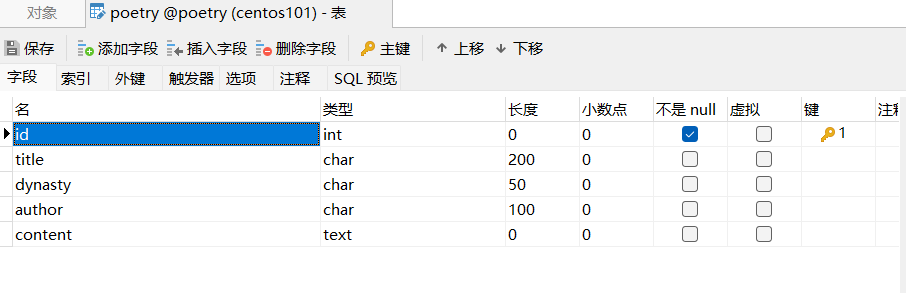
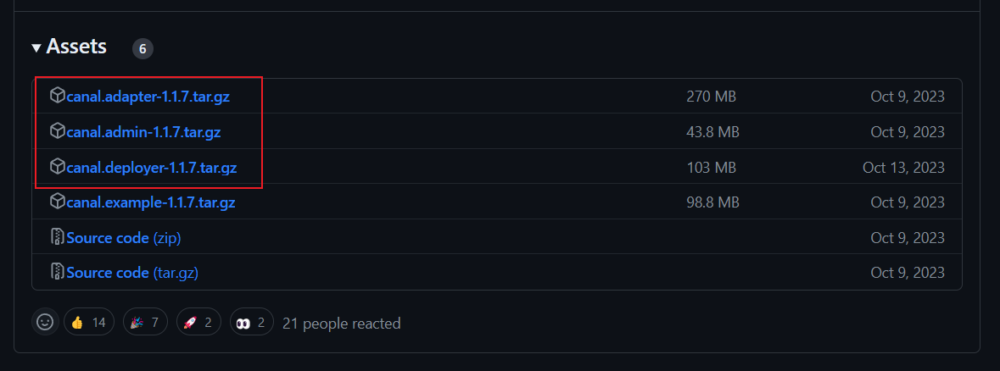
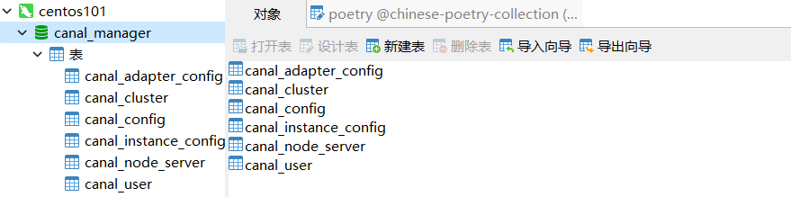
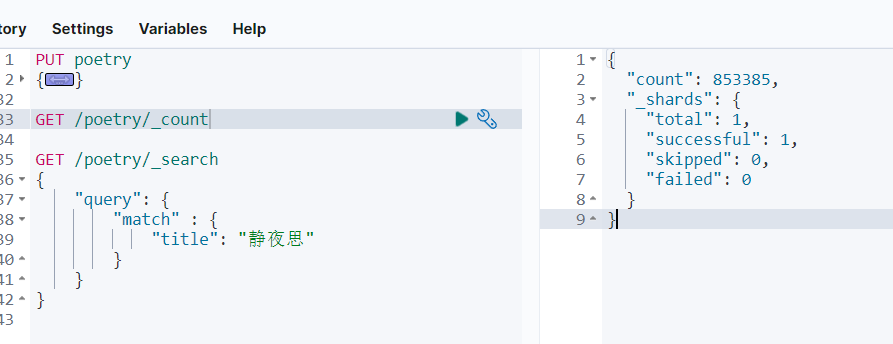
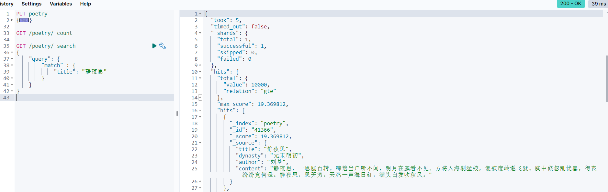
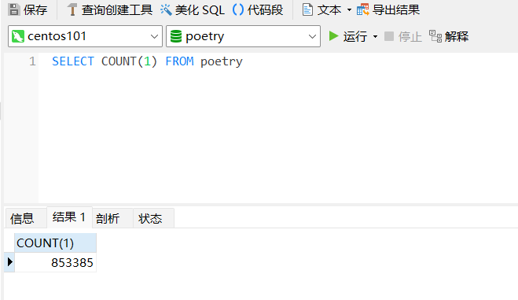

# 将 MySQL 的数据同步到 ElasticSearch

>最近从github上看到一个[~~中国古诗词库~~](https://github.com/chinese-poetry/chinese-poetry)，[简体古诗词库](https://github.com/Werneror/Poetry)，觉得可以用来做一个项目。将数据存储到MySQL之后，后面如果需要使用模糊搜索，需要用到ES，所以需要将MySQL的古诗数据存储到ES中，Canal可以用来实现这个操作。

## 相关项目

* 前端：[https://github.com/zorroe/ancient-poetry](https://github.com/zorroe/ancient-poetry)
* 后端：[https://github.com/zorroe/poetry-backend](https://github.com/zorroe/poetry-backend)

## 表结构



## Canal是什么？


**canal [kə'næl]**，译意为水道/管道/沟渠，主要用途是基于 MySQL 数据库增量日志解析，提供增量数据订阅和消费

## 搭建环境

本次使用的各种软件所使用的版本为

| 软件          | 版本   |
| ------------- | ------ |
| MySQL         | 8.2.0  |
| JDK           | 1.8.0  |
| Canal         | 1.1.7  |
| ElasticSearch | 8.12.2 |
| kibana        | 8.12.2 |

## Docker安装ELK

1. git克隆仓库

   `git clone git@github.com:deviantony/docker-elk.git`

2. tl;dr

   `docker-compose up setup`

   `docker-compose up -d`

默认打开的端口如下

* 5044: Logstash Beats input
* 50000: Logstash TCP input
* 9600: Logstash monitoring API
* 9200: Elasticsearch HTTP
* 9300: Elasticsearch TCP transport
* 5601: Kibana

用户名密码如下

* user：elastic
* password：changeme

集群名（elasticsearch/config/elasticsearch.yml>cluster.name）

* docker-cluster

## 下载安装Canal

### 下载Canal



三个都下载

### 配置MySQL

配置数据库`my.ini`文件

```ini
[mysqld]
#设置serveri_id
server_id=1
#开启二进制日志功能
log-bin=mall-mysql-bin 
#设置使用的二进制日志格式（mixed,statement,row）
binlog_format=row 
```

配置成功后重启MySQL

创建从库账号`canal:canal`

```shell
mysql> create user canal identified by 'canal';
mysql> grant select, replication slave, replication client on *.* to 'canal'@'%';
mysql> flush privtleges;
```

## 配置Canal-server(canal-deploy)

canal-server（canal-deploy）：可以直接监听MySQL的binlog，把自己伪装成MySQL的从库，只负责接收数据，并不做处理。

解压压缩包`canal.deployer-1.1.7.tar.gz`，解压完成后的目录结构如下

```shell
├── bin
│   ├── restart.sh
│   ├── startup.bat
│   ├── startup.sh
│   └── stop.sh
├── conf
│   ├── canal_local.properties
│   ├── canal.properties
│   ├── example
│   │   └── instance.properties
│   ├── logback.xml
│   ├── metrics
│   │   └── Canal_instances_tmpl.json
│   └── spring
├── lib
├── logs
└── plugin
```

进入`conf`路径，修改配置文件`canal.properties`

```properties
# canal的server地址
canal.ip = 127.0.0.1
# canal端口
canal.port = 11111
```

进入`conf/example`路径，修改配置文件`instance.properties`，修改数据库相关配置

```properties
canal.instance.master.address=192.168.10.101:3306
canal.instance.dbUsername=canal
canal.instance.dbPassword=canal
canal.instance.connectionCharset = UTF-8
canal.instance.filter.regex=.*\\..*
```

进入bin路径，运行`startup.bat`

## 配置canal-adapter

canal-adapter：canal的客户端，会从canal-server中获取数据，然后对数据进行同步，可以同步到MySQL、Elasticsearch和HBase等存储中去。

解压压缩包`canal.adapter-1.1.7.tar.gz`，解压后的目录结构如下

```shell
├── bin
│   ├── adapter.pid
│   ├── restart.sh
│   ├── startup.bat
│   ├── startup.sh
│   └── stop.sh
├── conf
│   ├── application.yml
│   ├── es6
│   ├── es7
│   │   ├── biz_order.yml
│   │   ├── customer.yml
│   │   └── mytest_user.yml
│   ├── hbase
│   ├── kudu
│   ├── logback.xml
│   ├── META-INF
│   │   └── spring.factories
│   └── rdb
├── lib
├── logs
│   └── adapter
│       └── adapter.log
└── plugin
```

进入`conf`目录，修改`application.yml`

```yml
server:
  port: 8081
spring:
  jackson:
    date-format: yyyy-MM-dd HH:mm:ss
    time-zone: GMT+8
    default-property-inclusion: non_null

canal.conf:
  mode: tcp #tcp kafka rocketMQ rabbitMQ
  flatMessage: true
  zookeeperHosts:
  syncBatchSize: 1000
  retries: 0
  timeout:
  accessKey:
  secretKey:
  consumerProperties:
    # canal tcp consumer
    canal.tcp.server.host: 127.0.0.1:11111
    canal.tcp.zookeeper.hosts:
    canal.tcp.batch.size: 500
    canal.tcp.username:
    canal.tcp.password:

  srcDataSources:
    defaultDS:
      url: jdbc:mysql://192.168.10.101:3306/poetry?useSSL=false&useUnicode=true
      username: canal
      password: root
  canalAdapters:
  - instance: example # canal instance Name or mq topic name
    groups:
    - groupId: g1
      outerAdapters:
      - name: logger
      - name: es8
        hosts: http://192.168.10.101:9200
        properties: 
          mode: rest
          security.auth: elastic:changeme
          cluster.name: docker-cluster
```

进入`canal-adapter/conf/es8`目录，修改`mytest_user.yml`文件，用于配置MySQL中的表与ES索引的映射关系

```shell
dataSourceKey: defaultDS   # 源数据源的key, 对应上面配置的srcDataSources中的值
destination: example    # canal的instance或者MQ的topic
groupId: g1   # 对应MQ模式下的groupId, 只会同步对应groupId的数据
esMapping:
  _index: poetry  # es 的索引名称
  _id: id  # es 的_id, 如果不配置该项必须配置下面的pk项_id则会由es自动分配
  #  upsert: true
  #  pk: id
  sql: "SELECT p.id AS id, p.title AS title, p.dynasty AS dynasty, p.author AS author, p.content AS content FROM poetry p"
  #  objFields:
  #    _labels: array:;
  etlCondition: "where p.id>={}"
  commitBatch: 3000
```

进入bin路径，运行`startup.bat`

## 配置canal-admin

canal-admin：为canal提供整体配置管理、节点运维等面向运维的功能，提供相对友好的WebUI操作界面，方便更多用户快速和安全的操作。

解压压缩包`canal.admin-1.1.7.tar.gz`，目录结构如下

```shell
├── bin
│   ├── restart.sh
│   ├── startup.bat
│   ├── startup.sh
│   └── stop.sh
├── conf
│   ├── application.yml
│   ├── canal_manager.sql
│   ├── canal-template.properties
│   ├── instance-template.properties
│   ├── logback.xml
│   └── public
│       ├── avatar.gif
│       ├── index.html
│       ├── logo.png
│       └── static
├── lib
└── logs
```

创建 `canal-admin` 需要使用的数据库`canal_manager`，创建SQL脚本为`conf/canal_manager.sql`，会创建如下表；



修改配置文件`conf/application.yml`，按如下配置即可，主要是修改数据源配置和`canal-admin`的管理账号配置，注意需要用一个有读写权限的数据库账号，比如管理账号`root:root`；

```shell
server:
  port: 8089
spring:
  jackson:
    date-format: yyyy-MM-dd HH:mm:ss
    time-zone: GMT+8

spring.datasource:
  address: 192.168.10.101:3306
  database: canal_manager
  username: root
  password: mysql_WDx6e8
  driver-class-name: com.mysql.jdbc.Driver
  url: jdbc:mysql://${spring.datasource.address}/${spring.datasource.database}?useUnicode=true&characterEncoding=UTF-8&useSSL=false
  hikari:
    maximum-pool-size: 30
    minimum-idle: 1

canal:
  adminUser: admin
  adminPasswd: admin
```

## 同步MySQL到ES

浏览器访问`192.168.10.101:5601`，用户：elastic，密码：changeme

创建索引（指定中文IK分词器）

```shell
PUT poetry
{
  "settings": {
    "analysis": {
      "analyzer": {
        "ik_analyzer": { 
          "tokenizer": "ik_max_word"
        }
      }
    }
  },
  "mappings": {
    "properties": {
      "id": {
        "type": "integer"
      },
      "title": {
        "type": "text"
      },
      "dynasty": {
      	"type": "text"
      },
      "author": {
        "type": "text"
      },
      "content": {
      	"type": "text"
      }
    }
  }
}
```

## 在MYSQL数据库中导入数据

> 省略

## 查看同步情况







同步成功🎉


## 添加中文分词器

[下载地址](https://github.com/infinilabs/analysis-ik)

下载对应版本的IK分词器，elasticsearch的plugins目录创建IK文件夹，上传到IK文件夹，解压到当前文件夹

创建索引的时候配置

```shell
PUT poetry
{
  "settings": {
    "analysis": {
      "analyzer": {
        "ik_analyzer": { 
          "tokenizer": "ik_max_word"
        }
      }
    }
  },
  "mappings": {
    "properties": {
      "id": {
        "type": "integer"
      },
      "title": {
        "type": "text"
      },
      "dynasty": {
      	"type": "text"
      },
      "author": {
        "type": "text"
      },
      "content": {
      	"type": "text"
      }
    }
  }
}
```

​	
