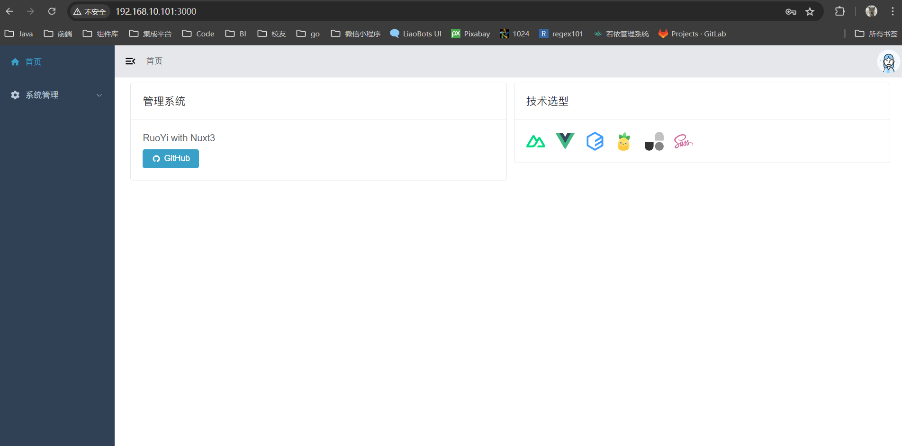

>Nuxt3项目地址为[🔗](https://github.com/zorroe/NuoYi)

# Dockerfile文件

```dockerfile
# syntax = docker/dockerfile:experimental

ARG NODE_VERSION=18.18.0

FROM node:${NODE_VERSION}-slim as base

ARG PORT=3000

ENV NODE_ENV=production

WORKDIR /src

# Build
FROM base as build

COPY package.json package-lock.json .
RUN npm install --production=false

COPY . .

RUN npm run build
RUN npm prune

# Run
FROM base

ENV PORT=$PORT

COPY --from=build /src/.output /src/.output
# Optional, only needed if you rely on unbundled dependencies
# COPY --from=build /src/node_modules /src/node_modules

CMD [ "node", ".output/server/index.mjs" ]
```

# 命令

```shell
# 打包
docker build -t NuoYi:0.0.1 .
# 运行
docker run -d -p 3000:3000 NuoYi:0.0.1
```

# 测试访问


