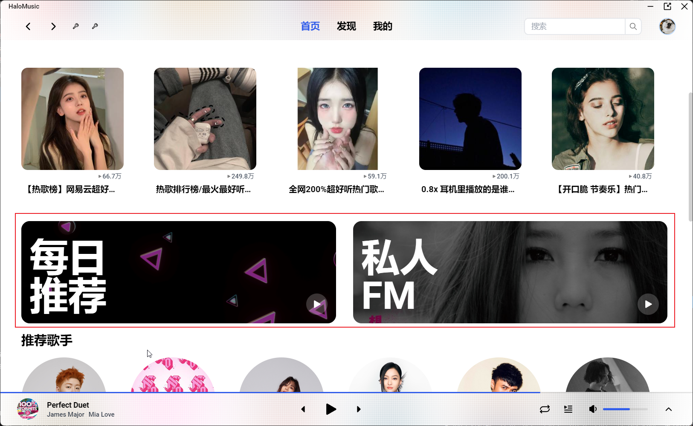

## V1.0.0
> 基础功能版本

1. 首页

   * 推荐歌单
   * 每日推荐
   * 推荐歌手
   * 新专速递
   * 排行榜

2. 歌单页、排行榜

   * 歌单详情
   * 播放、收藏
   * 歌曲列表

3. 歌手页

   * 歌手详情
   * 播放、关注
   * 热门歌曲
   * 专辑
   * MV

4. 专辑页

   * 专辑详情
   * 播放、收藏
   * 歌曲列表

5. 发现

   * 歌单分类
   * 歌单推荐

6. 我的

   * 我喜欢的音乐
   * 全部歌单
   * 收藏的专辑
   * 关注的艺人
   * 收藏的MV
   * 听歌排行

7. 搜索

   * 搜索相关歌手
   * 搜索相关歌单
   * 搜索相关歌曲
   * 搜索相关MV
   * 搜索相关用户

8. 登录

   * 扫码登陆

9. bugs

   >一些bug

## V1.1.0

1. 首页

   1. 首页修改每日推荐入口

   2. 新增私人FM入口

      

2. Footer组件

   1. 播放列表修改为若为私人FM播放，则不显示具体播放列表

      

   2. 新增音质选择项（TODO）

3. 重构PlayerStore

   1. 详情[见](https://zorroe.github.io/project/halomusic/playerStore.html)