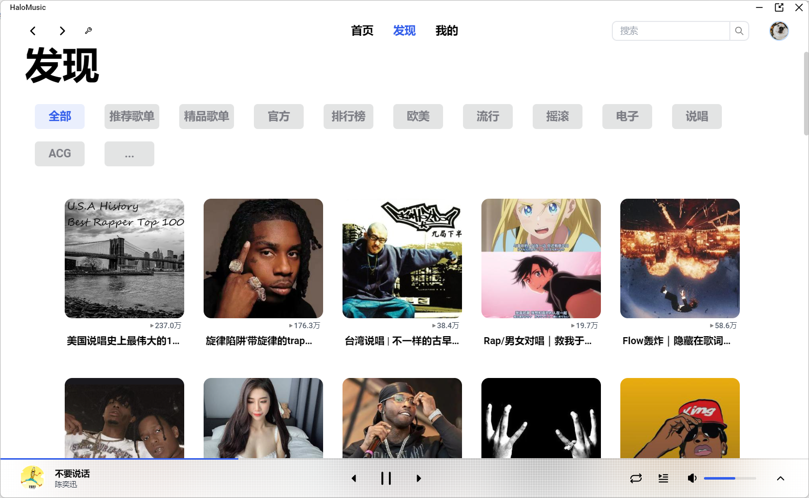
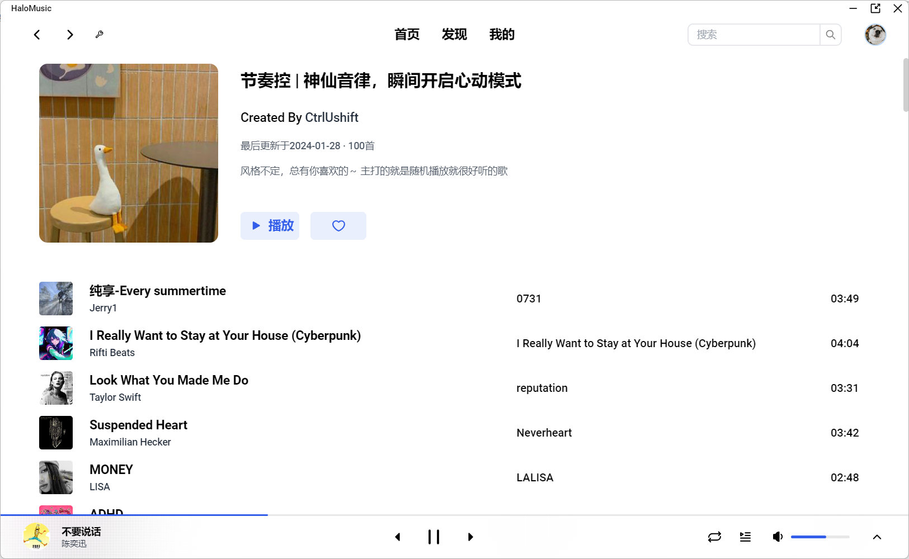
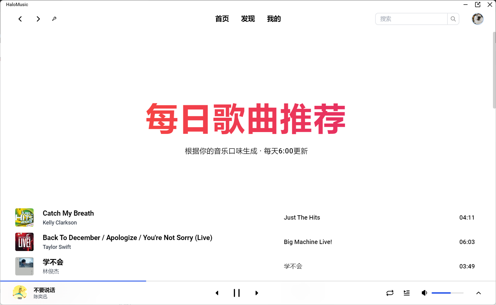
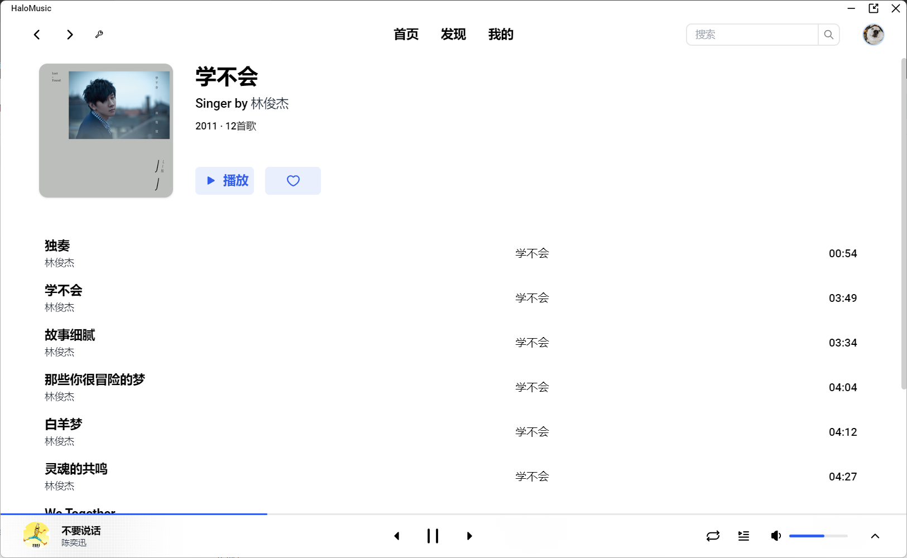
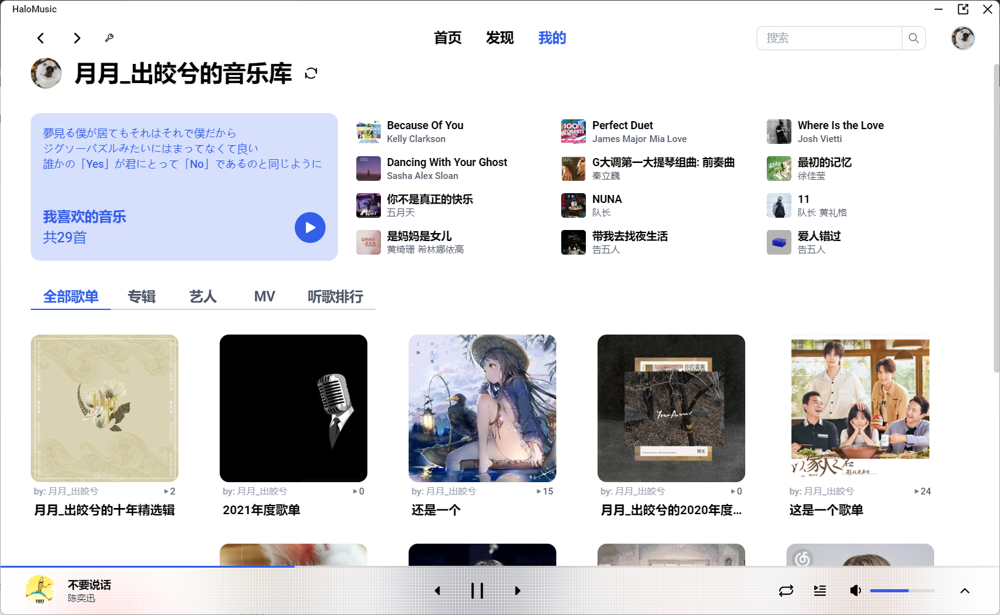
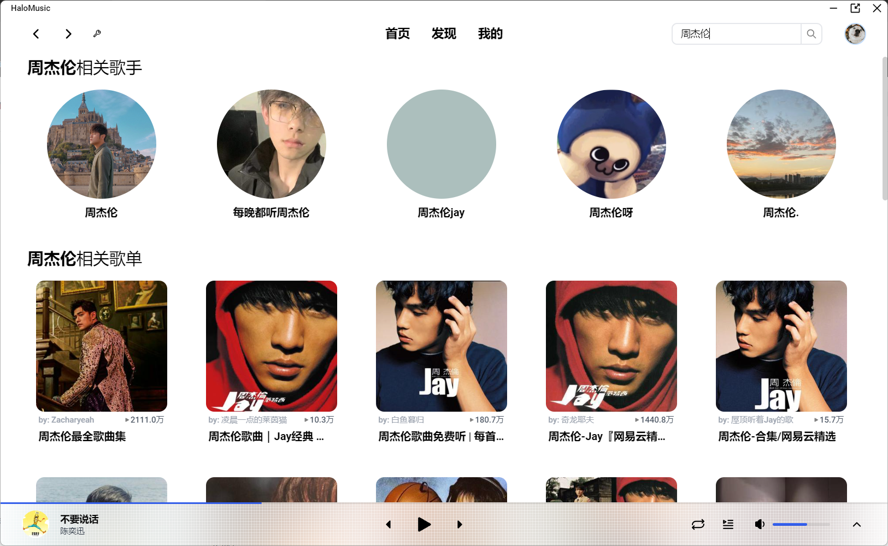
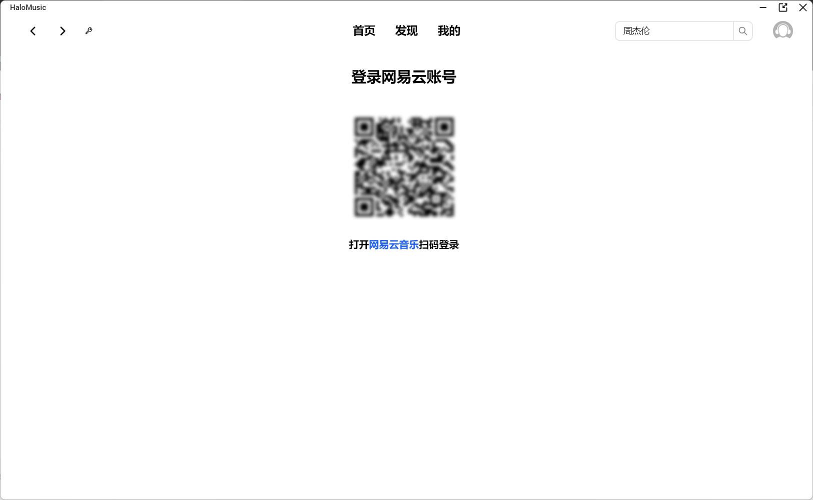

# HaloMusic

> 使用`Electron + Vue3`开发的一个桌面端音乐软件

## 技术栈

>1. Electron
>2. Vue3
>3. TailwindCss
>4. Vue-Router
>5. Pinia
>6. Axios

## 功能

1. 首页

   

2. 发现

   

3. 歌单详情

   

4. 歌手详情

   

5. 每日推荐

   

6. 专辑详情

   

7. 我的页面

   

8. 专辑页面

   

9. 搜索

   

10. 扫码登陆

    

## 从代码启动

>1. `git clone git@github.com:zorroe/HaloMusic.git`
>2. `cd HaloMusic`
>3. `npm i`
>4. `npm run dev`
>
>electron镜像 `npm config set electron_mirror=https://registry.npmmirror.com/-/binary/electron/`

## 开发计划

当前版本[v1.0.0]()

* v1.1.0
  1. 私人FM
  2. 每日推荐修改样式
  3. 私人云盘
  4. 修改听歌排行分为本周和所有时间
  5. 更换软件图标
* v1.2.0
  1. 设置（默认语言、音质、选择音频输出设备等、快捷键）
  2. 深色、浅色模式
  3. 歌曲缓存
* v1.3.0
  1. 最小化托盘
  2. 重构playerStore

## API

接口来自 ~~[Binaryify/NeteaseCloudMusicApi](https://github.com/Binaryify/NeteaseCloudMusicApi)~~

这个库已经不再维护，可以从[NeteaseCloudMusicApi](https://www.npmjs.com/package/NeteaseCloudMusicApi)获取

## 安装包

win: [v1.0.0](https://github.com/zorroe/HaloMusic/releases/download/v1.0.0/HaloMusic.exe)
