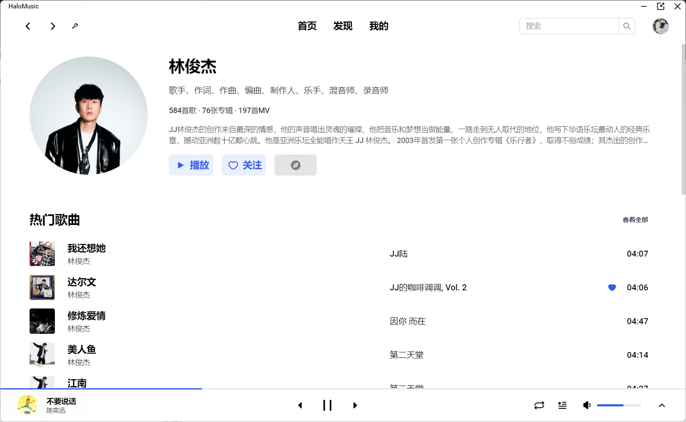

# HaloMusic

> 使用`Electron + Vue3`开发的一个桌面端音乐软件

## 技术栈

>1. [Electron](https://www.electronjs.org/)
>2. [Vue3](https://cn.vuejs.org/)
>3. [Tailwind CSS](https://tailwindcss.com/)
>4. [Vue-Router](https://router.vuejs.org/zh/)
>5. [Pinia](https://pinia.vuejs.org/zh/)
>6. [Axios](https://axios-http.com/zh/docs/intro)

## 功能

1. 首页

   

2. 发现

   

3. 歌单详情

   

4. 歌手详情

   

5. 每日推荐

   

6. 专辑详情

   

7. 我的页面

   

8. 专辑页面

   

9. 搜索

   

10. 扫码登陆

    

## 从代码启动

>1. `git clone git@github.com:zorroe/HaloMusic.git`
>2. `cd HaloMusic`
>3. `npm i`
>4. `npm run dev`
>
>electron镜像 `npm config set electron_mirror=https://registry.npmmirror.com/-/binary/electron/`

## 开发计划

当前版本[v1.0.0](https://github.com/zorroe/HaloMusic/releases/tag/v1.0.0)

* v1.1.0
  1. ~~私人FM~~
  2. ~~重构playerStore~~
  3. ~~每日推荐修改样式~~
  4. ~~修改听歌排行分为本周和所有时间~~
  5. ~~更换软件图标~~
* v1.2.0
  1. 设置（默认语言、音质、选择音频输出设备等、快捷键）
  2. 深色、浅色模式
  3. 最小化托盘

## API

接口来自 ~~[Binaryify/NeteaseCloudMusicApi](https://github.com/Binaryify/NeteaseCloudMusicApi)~~

这个库已经不再维护，可以从[NeteaseCloudMusicApi](https://www.npmjs.com/package/NeteaseCloudMusicApi)获取

## 安装包

win: [v1.0.0](https://github.com/zorroe/HaloMusic/releases/download/v1.0.0/HaloMusic.exe)，[v1.1.0](https://github.com/zorroe/HaloMusic/releases/download/v1.1.0/HaloMusic.Setup.1.1.0.exe)
